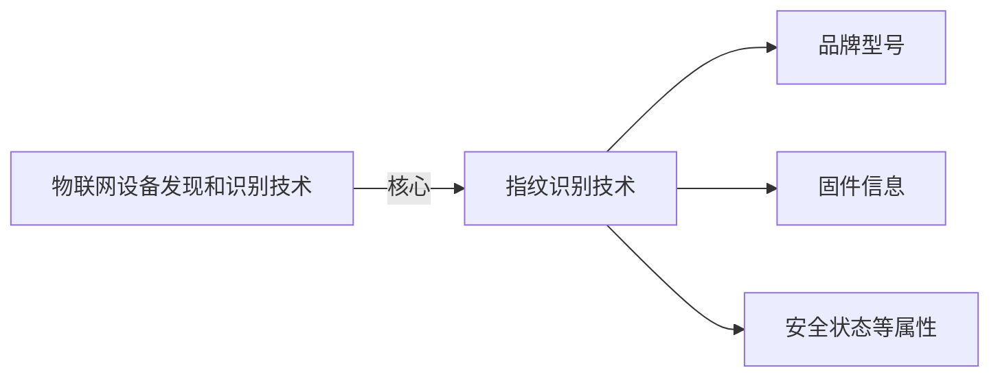
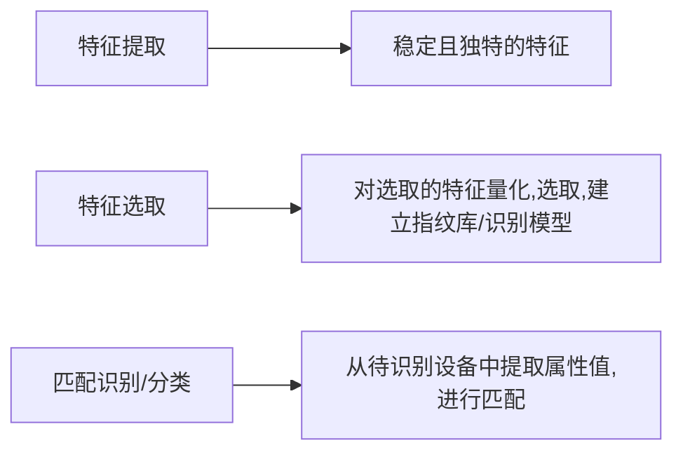

# 中科院博士论文

## 1.1.1物联网设备指纹识别技术



> 指纹识别技术基于物联网设备软硬件功能的差异，建立设备唯一性指纹，并根据设备响应报文中的特征信息进行对比，实现设备识别。
>
> 实现过程



设备属性=基本属性（固定）+安全属性（变化）

- 基本属性，出厂后固定属性，品牌型号，搭载系统等等
- 安全属性，与设备运行环境，攻击者等因素相关，动态变化性强

# 1.1.2 设备指纹识别挑战

> 当前技术问题：
>
> - 基于人工标定，效率低
> - 识别属性单一，唯一性差
> - 导致无法识别大量的、异构的、动态变化的、使用场景复杂的场景
> - 设备更新快，需要对识别模型进行对应的更新
>
> 具体而言，目前是采用：
>
> - 由安全人员挑选设备型号和对应的特征字段
> - 书写正则表达式/关键字等识别指纹
>
> 机器学习因为缺乏标注数据，而且每次更新模型都需要数据对应更新，成本大，同样无法满足大规模设备识别需求。

> 另一方面，现有指纹识别技术仅考虑设备的基本属性，未涉及到应用场景。
>
> 具体而言，物联网设备都是基于Linux嵌入式系统开发，OS在设备指纹方面的贡献小；
>
> 而设备型号粒度太粗，推断精度低；
>
> 设备硬件指纹集中在局部网络空间，需要较长的探测时间，或者需要目标设备的积极响应，在大规模网络中不可行。

# 1.2研究内容

> 论文主题集中在设备发现与识别，具体分为：有哪些设备、设备是否存在安全漏洞、设备是否被恶意利用。提出一种多属性的、自动化的指纹识别技术，快速发现**网络中**的物联网设备

- 内容1：从远程设备的，应用层响应报文中的，关键字特征出发，研究基于自动学习的**设备型号指纹识别**。

- 内容2：从固件中，远程可访问的文件特征出发，研究基于文件系统的**设备固件指纹识别**。
- 内容3：分析漏洞的利用特征，研究基于漏洞报告的设备**漏洞指纹**生成技术，从而判断设备是否遭受攻击。
- 

## 1.2.1 基于自动学习的物联网设备指纹识别技术

方式：远程探测，是被设备品牌，型号等等。

- 基于特征匹配的算法，包括关键字匹配和正则表达式匹配，需要人力，不支持更新。
- 基于机器学习的方法，同样因为人力、不支持更新，体现在数据标注上。

本文提出的自动化方法，体现在利用设备的应用层响应信息中提取的特征字段，在搜索引擎中爬取相关页面，然后根据自然语言处理技术从页面描述中提取设备标识，最后基于关联算法，生成物联网设备的规则。

本方法的优势在于，不依赖人工，自动从响应层信息中鉴别特征字段；利用搜索引擎优势，扩大对关键特征的先验知识，解决了自动化问题和易失效问题。

## 1.2.2 基于文件系统差异的固件指纹识别技术

设备固件：**半永久储存在嵌入式设备硬件中的软件**，为设备提供基本的控制管理和数据处理功能，不同的固件版本对应不同的漏洞。使用固件指纹，就能查询现有的cve等报告，分析设备是否有安全隐患。

固件更新，会导致源代码和文件系统的变化，由于物联网设备通过web接口对外提供服务，设备功能模块的改变，会体现在web服务上，进而导致web服务器文件系统的差异，该特征可被远程感知，而且具有稳定性，差异性。

将web服务器文件系统特征作为设备固件指纹步骤：

- 分析web服务器文件系统的差异性，验证稳定性和差异性是否符合要求。

  - 大范围设备固件指纹识别，分析提取的设备特征，创造足够多的设备。

  - 结合NLP和DOM模型，把响应信息表示为特征矩阵/固件指纹

- 将远程设备的响应信息，和特征矩阵比对，实现设备固件信息的准确识别。

## 1.2.3基于漏洞报告理解的漏洞指纹生成技术

目前针对物联网设备攻击都是利用已有漏洞，使用者的攻击脚本原型可以在漏洞报告中找到。

因此，我们可以使用NLP，提出

- 基于关联依赖的物联网漏洞安全实体提取方法

- 语义信息和结构信息结合的，漏洞利用特征，自动生成方法。

- ```mermaid
  flowchart LR   
    实现网络空间的
    漏洞报告自动收集 --> 漏洞报告内容自动评估分析 --> 漏洞利用特征自动生成
      
  ```

- 提取的漏洞特征部署在IDS和防火墙，用于保护物联网设备

创新点在于利用NLP，自动提取漏洞指纹，用软补丁的方式应用到防火墙上，有效解决物联网设备资源受限，缺乏自动化更新机制的问题。

# 2.1理论基础，研究现状

## 2.1.1 物联网设备指纹识别技术

指纹识别技术基于物联网设备在自身硬件、协议栈、业务应用等方面的差异，建立指纹模型，提取指纹信息，建立指纹库或识别模型，与设备响应报文中的特征信息进行比对，进行设备识别。


安全属性与设备运行环境，维护更新等相关，例如管理员配置不当导致的弱口令、设备本身固件漏洞、攻击者等等。

- OS识别

  - TCP/IP协议中，某些字段是可选的，开发者会自定义这些内容，比如TTL值（丢弃包之前允许的最大字段），IP是否分片，TCP窗口大小等等存在差异。早期研究侧重于在TCP/IP协议栈中挖掘可区分OS的特征。这种方法适用于小规模网络的设备识别。

    - **小规模**。Nmap是代表工具。通过项目表设备的1个开放端口和1个接收端口发送共16个TCP/UDP/ICMP探测包，基于目标设备的回应信息，提取目标的OS指纹。最后用获得的指纹进行模糊签名匹配，识别目标主机的OS。还有Xprobe2++,p0f   Ettercap，SinFP等等。

      这些工具都需要对TCP/IP协议进行多重检测，产生大量数据；网络故障产生的畸变数据也能触发防火墙，影响目标设备使用。探测包来回时间开销和时间阈值设定也需要成本。

      适用于安全员进行安全审查，不适用于大规模网络。

    - **全网空间**。RING和Snacktime是基于单探测包的超时重传特征进行识别。对于发送单个包没有收到回复的时候，会采用超时重传机制，服务端会重复发送多个SYN-ACK到客户端，直到超时发送RST。根据不同OS在发送多个SYN-ACK时的时间间隔，构建特征向量。

      这些方法都使用两个超时重传SYN-ACK的间隔，RING结合是否存在RST终止符作为特征；Snacktime结合SYN-ACKs包的默认窗口大小、TTL值。

      为解决延迟抖动，Hershel提出随机理论（Stochastic Theory）。

      - 延迟抖动是指网络传输过程中，数据包到达目的地的时间不稳定，即偏离了预期的时延[3](https://www.rtcdeveloper.cn/cn/community/blog/25598)。具体来说，抖动是指最大延迟与最小延迟的时间差[4](https://www.eet-china.com/mp/a82420.html)。网络抖动会影响网络性能，导致实时通信中断等问题[3](https://www.rtcdeveloper.cn/cn/community/blog/25598)。为了解决延迟抖动问题，可以采取以下方法[3](https://www.rtcdeveloper.cn/cn/community/blog/25598)[4](https://www.eet-china.com/mp/a82420.html)：
        - √改用**有线**连接，减少无线干扰引起的延迟和抖动。
        - √使用虚拟专用网络（**VPN**）建立安全的路由通道，帮助减少延迟和抖动。
        - 建立一个内容交付网络（CND），使用缓存、连接优化和渐进式图像渲染等技术，让访问者访问内容的路线缩短。
        - √寻找并消除网络瓶颈，监测网络流量，确定问题所在，可以根据需要**重新安排路线或升级路由器**等。*网络层面管理，更侧重于识别和解决具体问题*
        - √使用下载管理器，通过管理负载分配，防止少数系统占用过量带宽，使网络能够更快地完成下载任务。*单机层面管理*
        - 优化网络配置，在一些关键位置，采用子网、最大流量调整和负载平衡等技术作为纠正措施。*侧重于优化整个网络*

      为解决噪声问题和提高系统鲁棒性，Hershel+【7】提出了新的方法。二者都是致力于：全网范围SYN扫描时，产生的随机失真，但是这些技术都假定网络中的参数都是先验知识（已知的，包括数据丢包可能性，OS流行程度，网络延迟分布等等）。但面对大部分未知网络，Faulds【8】提出对网络的未知参数分布提出：非参数化最大期望（EM）估计器。

- 品牌型号/TVP识别

- 设备硬件信息识别

## 2.1.2 设备型号指纹识别技术

物联网设备大多是基于嵌入式OS开发，在OS上制定服务，在操作系统层面差异少，因此基于TCP/IP的协议只能识别到操作系统层面，无法满足识别设备型号的要求。因此，研究人员采用应用层进行设备型号识别，包括物联网应用层

- 通用协议HTTP/SSH
- 专有协议Modbus（串行通信协议）/BACnet

具体来说

- 利用厂家定制的应用层协议，来对品牌型号进行识别

- 针对不同专有协议的解析，提取报文信息

现有设备型号识别基于通用协议和专用协议两种，

- 通用协议格式透明，设备识别集中在寻找不同厂商对同一个协议的字段选择上，主要观察应答报文的差异（例如TCP/IP的可选字段）
- 专用协议需要先确定哪些指令和报文能用来识别，目前都是人工提取指纹，然后使用正则表达式，关键词匹配等方法进行特征分析，**对协议的特征分析和理解不够**。

需要解决海量物联网设备的设备型号自动化识别。

## 2.1.3 设备硬件特征和指纹识别技术

具体指设备物理差异，用于区分型号、固件相同的设备，常用于设备建档、设备追踪、虚拟设备识别。

- 时钟偏移特性，通过计算探测包和响应包的时间差，建立设备的物理指纹，他独立于OS层面的指纹，但是受到网络干扰严重，因此采用基于时钟同步的抽样测量方式。

  后又有人提出了利用设备硬件时钟偏差导致的网络行为差异，提出了基于神经网络的指纹生成算法，用于发现虚拟设备。

这种技术是不是太老了？

## 2.1.4 设备安全属性指纹识别技术

> 用于确定设备的安全状态，设备安全属性指纹 识别技术包括
>
> - 存在安全隐患设备识别（缺失认证，弱认证、设备本身漏洞）
> - 被恶意利用设备识别（控制和感染设备）

- **脆弱性设备  指纹识别**

  - 方案1.根据设备在**应用层**不同的协议实现方式，提取特征，生成型号指纹。然后根据指纹，寻找网络中暴露的嵌入式设备，使用出厂密码进行尝试登录，得出弱口令设备的分布和持续时间。

  - 方案2.在全网空间探测SSH和HTTPS服务，获取这些服务的证书和主机秘钥，分析证书和密钥的安全性，从而分析使用这些协议的设备的安全性，找出安全威胁。

  - 方案3.利用ZMap进行快速发现，ZGrab进行应用层信息获取，ZTag进行设备识别，构建设备搜索引擎Censys：引擎支持搜索特定的协议字段，识别在该字段上具有漏洞的特定漏洞的设备。例如，搜索“443.https.cipher=xxx”，匹配该特征的搜索结果存在heartbleed漏洞。这种方法通用性差，仅适用于认证、加密等传统领域。

    Heartbleed漏洞，2014.4产生，允许攻击者从24-55%常用的HTTPS站点上远程读取受保护的数据

- 设备被恶意利用指纹识别

  - 有人通过重放恶意和正常流量，采用聚类的方法，通过“请求-响应”数据包的某些字段上的差异进行判别，建立指纹，识别恶意服务器。


# 3. 基于自动学习的物联网设备型号指纹提取技术

## 3.1 引言

物联网设备普及，但安全措施不足，成为广泛传播的潜在威胁。策略有主动防御和被动防御：

- 被动防御：下载设备固件镜像/捕获恶意代码，进行安全分析，从漏洞利用到检测有较长的时间间隔。

- 主动防御：预测恶意源，防止潜在攻击，适用于需要及时相应的大规模网络安全事件（Mirai僵尸网络）

  > Mirai是一个著名的僵尸网络（botnet）家族之一，最初于2016年出现并引起了广泛的关注。
  >
  > Mirai僵尸网络被用于发动大规模的分布式拒绝服务攻击（DDoS攻击）。此类攻击会将大量来自感染了Mirai僵尸恶意软件的物联网设备的网络流量集中到目标服务器上，导致服务器过载并无法正常运行。
  >
  > Mirai僵尸网络的攻击方式是通过利用物联网设备（如网络摄像头、路由器和智能家居设备）的弱密码和漏洞进行感染。攻击者会扫描互联网上的设备，尝试使用预设的默认用户名和密码进行登录。一旦成功登录并入侵设备，它们会将恶意软件植入设备中，将其转变为僵尸，并将其加入Mirai网络。
  >
  > 一旦形成Mirai僵尸网络，攻击者可以通过控制中心发送指令，将所有被感染的设备协调在一起发动DDoS攻击。这种攻击方式的特点是分散的攻击源，使得攻击者能够以巨大的网络流量来淹没目标服务器。
  >
  > Mirai僵尸网络的出现揭示了物联网设备的安全性问题，特别是默认密码和未修补的漏洞。这促使更好的安全措施，例如更强的密码策略、漏洞修补和网络防御机制，以防止设备被植入恶意软件并加入僵尸网络。另外，网络供应商和云服务提供商也采取了措施来过滤和缓解DDoS攻击。
  >
  > 
  >
  > 快速发现，对可疑设备快速标识是实现主动防御的基础。

  

  本章核心研究点在于：利用物联网设备应用层的响应包中关于厂商的信息，在网络上搜索相关网站上对产品的描述，建立应用层信息和相应描述网站。

  采用基于规则的指纹识别技术，挖掘应用层信息和相应网站之间的联系，自动生成设备识别规则。

  问题和难点：

  - 应用层信息由厂家定制，难以解析，难以提取有效字段。
  - 网络描述信息由非结构化纯文本显示，难以提取。

  解决方案：ARE，acquisition rule-based engine，可以在没有训练数据的前提下没自动生产设备指纹，进而发现设备。

  
  
  > 1.提取应用层响应信息
  >
  > 2.从响应信息中提取特征字段
  >
  > 3.将特征字段放到搜索引擎中搜索结果，对每个相关结果使用命名实体标识技术，提取设备标识（品牌型号。。。）
  >
  > 4.利用apriori算法从大量数据集中，挖掘相关规则
  >
  
  使用ARE后，自动获取设备指纹，以下是三个基于物联网设备型号指纹的应用：
  
  - 网络设备测量，IDM， internet-wide device measurement，发现识别全网的物联网设备
  - 设备是否被恶意利用检测，Compromised device detection，部署七个蜜罐，利用ARE对发出请求的设备进行识别（是否是物联网设备），如果该设备进行了恶意扫描，说明是被控制的设备。
  - 漏洞设备分析，利用已有漏洞库，对发现的设备信息进行匹配，找出可能有某些漏洞的设备。
  

## 3.3 自动规则生成

规则挖掘方法。


### 3.3.1 事务集合定义

$$
T=\{t_1,t_2,...,t_m\}\\
t_i=\{p_i,w_j\},p_i是设备i的响应层数据，w_j是网页j的描述/文本信息
$$

### 3.3.2 规则自动生成

规则如下
$$
\{l_1^i,l_2^i,...,l_n^i\}->\{t^j,v^j,p^j\}
$$
根据第i个设备提取到的关键字1-n，得出网页中包含的设备类型，设备厂商，设备型号

### 3.3.3 设备命名实体识别

因为标准NER并非是为物联网设备实体信息设计的，因此使用物联网设备实体识别DER：


*DER是基于词典/语料库命名实体识别和基于规则命名实体识别的组合。*

- 定义三个类：类型、厂商、型号，网页中的相关单词被划分到对应类中
- 通过在网络上手动搜集厂商名称和设备类型，加入到DER的语料库中，即使以后有更新，也只需要添加到语料库即可
- 对于产品型号，无法列举，只能用正则表达式匹配

仅仅基于上述方法，会有高误报率。因为有的网页只是提到了该设备，但也包含设备关键字，因此还需要通过关键字之间（对DER来说，就是实体之间）的局部依赖性来识别设备实体。


建立的依赖关系/**事务**分为两种：

- （设备类型，厂商，产品型号）信息完整，使用实体出现的顺序，来消除多个重复的标签。即出现三元组后，文章中其他相同元素可以省去。
- （设备类型，厂商，NULL）设备标识只包含前两者，DER按照厂商实体->设备类型实体的顺序选择事务数据。

### 3.3.4 设备识别规则生成


使用Apriori算法自动生成规则，寻找响应中特征字段和网页描述中的设备标识之间的依赖关系。生成规则为
$$
\{q_i^1,q_i^2,...,q_i^n\}->\{t_j,v_j,p_j\}
$$
如果响应数据中包含q，就把这个设备标识为
$$
\{t_j,v_j,p_j\}
$$
然后把生成的设备响应数据和指纹库中的，根据网页信息提取的规则匹配，从而识别物联网设备。

参数：支持度(出现条件的事务 占 总事务的比例)，置信度（出现规则事务 占 出现条件事务的比例）。
$$
Transcations(T)={t_1,t_2,...,t_n}
\\support(A)=\frac{\sum_i^nA\in t_i}{T}\\
confidence(A=>B)=\frac{support(A\cup B)}{support(A)}
$$
在本方法中，集合B，也就是设备指纹库的产生是根据条件A，也就是网页内容产生的，即A=>B存在潜在映射。

测试方法：选择一个IP地址，生成数据集。250个应用层数据包，5种设备，48个厂商，341个产品型号，产生2499事务。删除只出现一次的元祖。最后选出support(A)=0.1%,conf(A=>B)=50%性能较好。

- 如果希望识别更多不常见的事务(A=>B)，则应当降低sup(A)
- 如果希望识别更多的设备标识(B)，应降低conf(A=>B)的阈值;如果追求准确，则提高conf(A=>B)的阈值。

识别规则冲突处理：概率模型，为每个输出提供均等的概率，最后根据多数表决，选择最高置信度的规则。

及时添加新的事务实例，也可以在算法更新时，自动生成规则。

### 3.3.5 局限性

- 响应数据伪造。事务的产生，是物联网设备响应数据，和搜索引擎相关网页的关联。如果是蜜罐等仿造IoT设备的相应数据，就会产生错误响应。攻击者也可以修改应用层数据，来恶意利用设备。但这二者数量少，直接篡改应用层数据也会被管理员检测，影响不大。
- 中间件设备，许多IoT设备位于防火墙、NAT等中间件后面，外部无法访问，设备探测也无法穿透中间件。这时就要依赖有权限搜索内部网络的app，就可以收集内网数据，学习新规则。本文的ARE可以部署在内网，用于发现、识别本地网络IoT设备。
- 原始设备制造商OEM。厂商的外包，可能让多个不同厂商的零件混合，同一个设备会有两种指纹。有的不同设备共享某个零件，由同一厂商代加工，也会导致特征雷同。无法解决
- 私有二进制协议，应用层如果使用私有协议/二进制协议，则无法解析数据包为文本。因缺少分析IoT设备专有协议的工具，ARE也无法识别这种设备。
- 可扩展性，ARE可以为非IoT设备生成识别规则，只要是基于特征识别的应用。例如，在线服务也会为请求数据提供明文应答。如果应答报文包含在线服务相关信息，那么也可以使用ARE进行服务识别。

## 3.4 系统设计与实现

