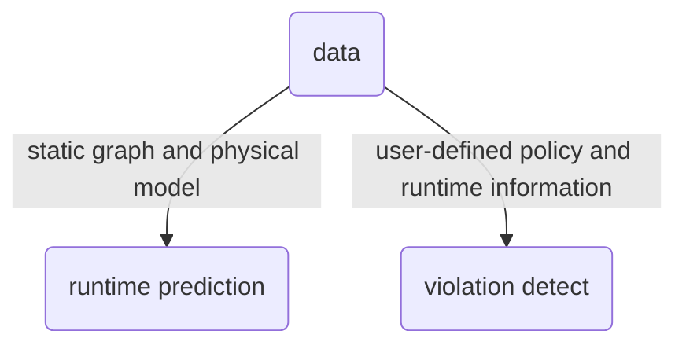
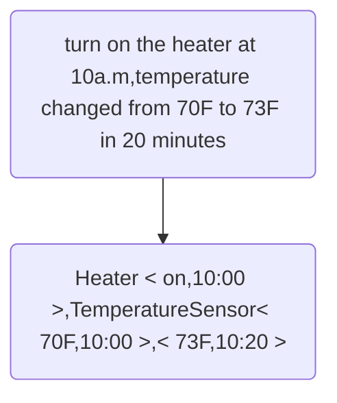

# IoTSAFE

IoTSAFE： Enforcing Safety and Security Policy with Real IoT Physical Interaction Discovery

# 摘要

物联网设备平台提供了很多新特性，支持用户通过IoT设备，控制物理环境。为了解决新出现的安全隐患，提出了一种通过设备的上下文特征和智能家居平台，进行捕获和管理设备真实物理交互的方法：IoTSAFE。

该方法可以预测未来的危险情形，阻止设备向不安全状态转化。IoTSAFE模型预测了39种真实存在的物理交互，以及130种可能存在的物理交互，在预测温度相关的交互上有96的正确率。

设备交互分为网络流量交互和物理交互。

- 网络交互。在本文中指：多个app订阅同一个设备/操作同一个设备。和进程通信一样，多个app通过操作共享变量（device attribute，或者software variable）进行交互。

- 物理设备交互。基于IoT设备可以对物理环境进行交互，IoT设备网络允许订阅不同设备的app，通过共享的物理环境参数，进行外部交互，而不需要对同一个特定设备进行订阅。这么做可以更多依赖于IoT设备本身的功能，而不需要去额外实现对其他设备（网关等等）的接口。

# 相关工作

- Soteria和IoTSan设计了一个先验reference policy集合，强制要求环境中的app符合这些约束。然后通过把所有app安装到同一个测试环境，操作相同的IoT设备，来对规则进行验证。这两种方法更专注于辨别由网络流量交互产生的不安全condition，例如多个设备对同一设备属性操作时，出现访问冲突或不正常操作（开窗开空调）。
- IoTMon对IoT设备进行离线测试（static analyze），获取了162个潜在交互。但是静态测试只能对可能的安全问题进行捕获，对于动态运行环境下的policy violation没有进行检测。IoTMon通过对app的描述信息进行文本信息挖掘，发现IoT设备可能涉及的物理信道，然后在此基础上进行物理交互的分析。因此无法应用于动态分析，也就无法考虑到物理交互的时间顺序，物理分布，设备覆盖范围等因素对policy enforcement的影响。
- IoTGuard对IoT设备进行动态的措施执行（policy enforcement），通过分析app的运行时行为，对可能的不安全状态进行封锁，即不能跳转到这个状态，有点对状态机进行动态剪枝的意思。限制和上面的一样，集中在app的流量分析上，而没有考虑物理环境的交互。另一个限制是，只有当设备在状态机中接近不安全状态时，才会enforce policy，对于加热设备可能太迟了，会对设备造成损害，或者延迟触发不安全状态。
- 本模型通过动态测试和静态分析工具结合，获取IoT物理交互行为。目的是结合时间、空间信息，以及设备、环境限制条件，获取设备运行时物理交互。
  - 捕获设备物理交互的方法。通过静态分析和动态测试，从设备运行环境上下文中，获取设备运行时的交互信息，同时减少测试开销（并行测试）。
  - 基于物理交互信息，建立物理状态模型，预测时间相关的交互，导致的可能的风险状态。进而能够提前阻止设备行为。
  - 在真实环境下表现良好。

# 设计动力/威胁模型

- IoT设备在物理属性上的操作可能具有延时性，例如温度，即使关闭后，设备仍能够对物理属性进行修改，因此会导致安全措施执行过晚，使设备进入不安全状态。
- 对物理信息进行判定，需要行为时间、运行空间、设备覆盖范围等信息。因此需要获取房屋结构、设备影响范围、环境状况等额外参数。

## 1.真实物理交互行为识别的挑战

- 以下是四种挑战：
- 
- Spatial Context：对于温度等信息，需要设备在同一个room内，否则错误的感应会导致危险行为。
- Temporal Context：不同环境参数的变化所需时间相差很大。对于光传感器，是可以产生即时影响，对于温度传感器，可能需要时间才能产生显著的环境交互行为
- Implicit Effect：一个设备的行为，对多个设备产生多个物理影响，例如温度升高同时会对湿度产生影响。
  - 目前的静态方法无法识别该物理影响，因为目前的物理交互大多是基于app的description进行针对性分析，只能找到在一个设备控制app中明确定义的关系。例如扫地机器人主要是对扫地功能进行描述，而没有描述对于运动传感器的影响。
- Joint Effort：多个设备同时工作，会产生比多个设备单独工作产生的影响更大。

​		物理交互对上下文敏感（包括环境属性和周围设备），因此难以准确描述一个设备的通用性交互行为。静态方法是无法获取真实环境中的设备行为的，因此需要动态测试来获取真实的物理交互，来为后面的动态policy enforcement做支持。

## 2.时间相关的物理交互行为的控制的挑战

- 温度相关设备关闭后，依然后对物理环境参数产生影响。及时采取了措施，依旧会在延迟后触发规则触犯（violation）。
- 另一个挑战是商用IoT传感器的长报告时间间隔（long report interval）。物联网设备由于使用低能耗电池，报告自身状态的周期长，这会导致发生危险状态后，服务器需要过一个周期/report interval才能得到对应的信息，高敏感度传感器成本高，不适用。


## 3.Thread Model


安全措施的执行失误，往往是由于预期之外的（模型外），或者不真实的物理交互；二者分别产生不及时的措施执行和错误的措施执行。

- 预料之外的物理交互产生包含两个条件
  - 攻击者无法直接控制敏感设备的控制app（设备的服务端）
  - 设备本身不容易被攻击者攻破（设备的客户端）
- 因此，攻击者可以通过控制其他易攻破的app，进而控制其他设备，触发特定行为，进而诱导安全的设备进入不安全状态，实现攻击。就好像用网络中的流量攻击一样，只不过是物理设备的交互流。
- 基于三个假设：
  - IoT运行的平台和策略执行系统是安全的，即环境数据和执行的策略都是正确的。
  - 制定的策略都是可信的，不是恶意植入的。
  - 这些策略不会自冲突（预先设计规则）。
- 这样我们就只要考虑真实环境，真实策略下，可能产生的物理交互攻击方式。对于恶意策略，需要用额外的模块进行检测、筛选。

# 系统总览


包括app analyse，real physical interaction discovery，runtime prediction，policy specification and enforcement四部分。

## Module1：app analyse

app analyse的目的是，通过分析app中的控制流，以及运行时的用户设置/配置文件，区分app的功能，找到可能相互关联的IoT设备。

- static control flow，常见的app控制流包括：触发条件/trigger，行为/action，用户配置/user setting。

  代码分析模块（code analyse module）

  - 通过提取相应的（trigger->action），来构建静态交互流，进而产生静态交互图。
  - 同时基于设备提供的房间信息（room information），为设备提供粗粒度的分组信息。
  - 最后在app部署之后/运行时，收集用户的配置信息，生成细粒度的设备交互图

## Module2：real physical interaction discovery

real physical interaction discovery的目的是，基于给定的智能家居环境，有效的识别真实存在的物理交互。

​		在app部署后，IOTSAFE通过用户配置（预先指定的规则）和房间的信息，**产生测试用例**。然后对于产生的用例，在满足环境约束的前提下（开窗的时候不应该打开空调...之类的），执行动态测试，最后**生成一张有向图**，包括设备的各个状态和状态转变关系。

​		动态测试包括线性测试和并行测试：

- 空间上相关的，可能具有隐性关联的，以及具有协同效应的（joint effort）设备，需要执行系统的（有序的）线性测试。
- 其他用例可以通过房间内的时间并行和多房间的空间测试来加快速度

*对于可能导致财产风险和威胁人身安全设备，我们不进行测试，而是用网上的信息进行评估*

## Module3：runtime prediction

​		该模块是为了结合有向图，初始化生成，以及维护更新设备的物理交互模型，用于描述设备物理交互的时间关系和时间范畴上的影响。

​		然后，就可以根据运行时的实时事件，与模型中的state进行对照，从而预测下一个可能的设备状态。也就是状态机的状态预测。

设备模型构建过程，需要先通过测试阶段的数据进行模型初始化

- （利用静态图），对于新设备和未测试设备，使用网络上有用的信息进行初始化和模型训练
- 对于用户修改设定（setting/configuration），通过更新交互图来调整设备状态和状态转换关系
- 正常情况下，会因为不断有新设备信息，图会不断动态调整。

## Module4：policy specification and enforcement

该模块的目的是，使用一个用于控制的服务器，通过检测app的event和action，与实现存储的，用户定义的policy进行比对，检测是否有policy violation。

- 首先由用户通过管理权限的app设置经验规则
- 数据收集模块（sensor）和app手机运行时设备信息，将数据发送到运行状态预测和冲突检测模块。
- 当判断可能出现危险的状态，或者可能会冲突用户规则时（即时/延时），本模块负责执行操作（enforcement），包括发送警告信息，或直接关停设备。



# 系统设计

## 1.app analyse

静态分析的目的：识别基础的，可能存在的物理交互行为，为进行动态测试提供环境/模型基础。

由代码分析模块和交互图构建模块组成。因为是在IoT的智能家居环境中，用户设定和设备的环境信息是已知的。

- 1.首先使用代码分析模块，提取已部署的多个app之间的依赖关系图。
- 2.同时向已知代码中**植入自己的代码**，用于提取用户setting，以及用于植入措施执行模块（上述模块4）
- 3.最后，调用图构建模块，使用用户setting中的某些字段（device id，trigger condition，room information），构建跨app的交互图。

### 1.2代码分析和植入

- 在代码分析模块通过静态分析，获取了一个app中，多个程序间的依赖关系（每个程序都是一个IoT设备运行的进程，程序的依赖关系和调用顺序就是IoT设备的依赖关系和交互顺序）。

  结合依赖关系以及物理信道分析（location/spacial，time/temporal），就可以实现跨app的，跨设备的依赖关系。


- 对源代码进行打补丁/代码植入，功能包括数据收集和运行时的控制命令（具体就是模块四的代码）

  代码植入示例

  ```python
  <name:"Turn on it when water detected">
  def installed(){
      subscribe(watersensor1,"watersensor",waterHandler)
      info = getdeviceInfo()
      sendRequest(info) # 向server发送设备数据
  }
  # 额外逻辑，负责执行服务器的policy
  def waterHandler(event){
      actions = "switch.on()"
      response = sendRequest(event,actions) # 告知服务器目前自己的状态，以及想执行什么操作
      if(response == 1){# 服务器允许
          switch.on()# 执行
      }
  }
  # 
  def sendRequest(param){
      result = TRUE
      result = httpGet(url,path){
          param
      }
      return result
  }# Server response
  # 收集设备信息，通过httpPost传递给服务器
  def getdeviceInfo(){
      deviceInfo = []
      settings.watersensor1.each{
          deviceInfo << itr.displayName
          deviceInfo << itr.deviceId
      }
      return deviceInfo
  }
  ```

  植入的主要目的仍然是之前提到的：获取设备信息（设备自身request），必要时执行policy（设备自身接受response）

### 1.3交互图构建

  通过结合更多的信息（用户设置，设备环境信息），构建细粒度的图。包含两部分：

  - 提取特定的用户设定信息，例如设备id，房间信息room information
  - 基于上述额外信息，把整个交互图**分割成独立的子图**，对于包含在多个房间内的设备，加入到多个子图中。

## 2.real physical interaction discovery

物理交互模块的目的

- 去除不真实的物理交互，即因为攻击者的目的而可以加入的交互方式
- 辨别隐式交互（操作同一个环境变量）和联合交互（多个加热设备）
- 自动推测一个设备行为对其他设备状态的影响

挑战

- 挑战1：时间交互测试。不同于软件测试，物理交互测试需要时间。为了提高效率，我们要找到代价最小的设备行为序列（action sequence）作为测试顺序，同时使用并行测试。
- 挑战2：安全性测试。动态测试的环境是真实的家庭环境。这种测试用两个限制：
  - 设备限制，包括锁和灭火装置，在直接测试时会产生危险情形，因此应排除这些设备。
  - 条件限制，有的环境参数如果长处一定阈值，会对业主财产在程损失。

动态测试分为两阶段：产生测试用例，进行动态测试。

- 第一阶段基于静态分析的结果，提供所有可测试的用例。
- 第二阶段基于并行测试的思想，自动进行设备行为测试，收集传感器读数（环境参数）

### 1.生成测试用例

对于一个房间内的设备（grouped device），一个测试用例是所有可能通过物理信道交互的设备的，所有状态的集合。
$$
用States(D_i)表示设备i可能处于的所有状态/工作模式\\
用State(D_i)表示设备i当前的状态\\
那么一个测试用例就可以表示为：其他设备关闭时，某个设备的一个工作状态\\
{D_1.off,...,state(d_i),...,D_n.off}\\
对每个设备的每个状态遍历生成所有可能的测试用例。
$$
为了安全，把敏感设备从测试集合中移除，并使用两个迂回方法获取测试数据：

我们提供可能的静态交互数据

- 1.让用户去验证这些交互是否可能存在。
- 2.使用正常工作时，敏感设备的运行时数据，去验证我们提供的静态交互数据

对于时间交互测试，我们把设备具体的参数映射到我们定义的工作状态上，这样可以减少测试用例的取值个数。例如，把加热器的温度转换成`加热，降温，保温，关闭`，就可以用四个状态代替温度参数，减少用例数量，这和把端口映射到`不可用，系统，常用`等区间类似。

对于某些连接到智能插座的设备，把插座和设备视为整体，并视作只有开和关两个状态。

### 2.动态测试

对生成的测试用例，测试得出设备物理交互的空间影响，联合效应，隐式关系。为了安全，对温度湿度等参数设置安全信道，测试时确保信道内参数不产出阈值。

> 传感器的报告间隔（report interval）是指传感器在连续测量数据时，发送或记录数据的时间间隔。它表示了传感器从一次测量到下一次测量之间的时间间隔。

- 首先，通过传感器校准（calibration），获取设备运行时的正常波动范围。我们测量传感器读数的差值，以及两次相邻report之间的间隔。
  $$
  SensorVal(D_i,state,t)表示设备D_i在时间t、状态state下，传感器的直接读数\\
  \Delta SensorVal(D_i,state,t_1,t_2)表示设备在state下，两次report之间的读数差值\\
  我们还能借此获取传感器的汇报周期\quad interval=t_2-t_1
  $$
  该数值表示传感器的正常波动

  - 校准阶段，我们把它用作过滤因为环境噪声引起的错误交互的阈值。
  - 动态测试阶段，我们把它用作判断是否发生真实物理交互的阈值。

为了减少测试开销，采用如下方法：

- 线性测试（sequential testing）

  - 适用范围：对所有不能并行测试的用例，高效判断基于空间的，事件的，联合的，隐式的物理交互。

  - 执行线性测试的用例表明他们可能潜在的影响了同一个物理信道。

  - 对于线性测试，提高测试效率的办法是

    - 选择合适的测试顺序，这一点可以根据app上记录的设备触发条件，来减少两个设备之间的等待时间。（先用设备加热，后用设备降温，再用设备加热，而不是先加热，等待自然降温，再加热）
    - 另一个则是减少相邻测试用例之间的冲突影响（加热会导致湿度下降，使除湿装置延迟触发）

  - 给定一个测试用例，就对应一个设备的一个特定状态，对应时间的计算如下
    $$
    T_{cost}=\sum(t_{case_i})\\
    case_i表示只有i设备处于工作状态\\
    t_{case_i}= \left\{
    \begin{array}{ll}
      t_{work} & \text{if } D_I \notin D_{temp} \\
      t_{work}+t_{off} & \text{if } D_I \in D_{temp}
    \end{array}
    \right.\\
    D_{temp}表示和温度相关的设备，包括温度，湿度，空气质量，这些设备的t_{work}比其他设备更长\\
    t_{off}标识设备关闭的闲置时间，这里选择传感器的一个report\quad interval作为闲置时间\\
    $$
    一个report interval足够一个温度相关的设备产生持久的影响了，因此对于温度设备，选择一个report interval作为一个温度信道的记录时间，就一定可以记录至少一个完整report的数据（对于其他设备可能获得两个report的数据）。

  - 线性测试的顺序：根据目前的物理信道状态和其他设备的触发条件，确保尽量减少设备工作之间的等待时间。IOTSAFE利用贪心算法，对设备工作状态进行排序。对于有多个触发条件的设备，选择**最近可触发条件**进行测试，尽量缩短时间。

  - 还有一个问题，对于冲突，我们可能需要手动书写规则，避免不合常理的测试顺序，但按理说是不会发生的，因为在不合理的选择之前，应该有更加合理的执行策略被贪心选中。

- 单个房间内的并行测试

  - 对占用可能独立的物理信道的设备，执行并行测试
  - 
  - 如图五，环境内共有三个多用途传感器sensor1,sensor2,sensor3，用于感应温度和照度。下方的线表示传感器的report time。每两个独立的report代表一个完整的report interval。每个测试用例的时间都需要覆盖所有传感器的，一个完整的report interval。
  - *之前已经说过了，为了确保能有一个完整的report，至少需要读取两个独立连续的report，从而确保整个测试能包含所有传感器的intervals*
  - 光照和温度影响不大，因此并行测试，提高动态测试的效率。
  - 绿色箭头wait表示公式中，温度相关设备的闲置时间idle time。
  - IOTSAFE优先执行并行测试，然后对同一个信道上的多个case执行线性测试。
  - 并行测试的缺陷在于，对于潜在的隐式交互，并行测试可能无法察觉。因此，需要依赖于预先定义的规则，例如湿度和温度信道，将可能相关的信道留到线性测试中。
  
- 跨房间的并行测试

  - 对于包含跨房间影响的设备，我们比较他在不同房间的触发条件和目前的环境条件。

    - 如果只有一个测试用例满足触发条件，就先执行该测试。
    - 如果存在多个测试用例满足触发条件，使用贪心算法选择最合适的用例（和线性测试一样，选择最近可触发条件。例如目前73F，加热触发条件为70F，降温触发条件为80F，那么我们执行加热测试）

  - 跨房间测试用例如图五粉色箭头所示，属于空间并行，单房间属于时间并行。

  - 对于跨房间测试，挑战在于不同房间传感器的汇报时间是异步的。这要求我们设计一个同步机制。

    - 1.选择一个等待时间，该时间能够确保覆盖最长的传感器interval。

    - 2.选择合适的开始时间，截止时间，从而预留一个waiting time

    - 如图五所示，房间1有两个传感器，房间2只有一个，sensor1和2的report interval比sensor3长。IOTSAFE在calibration/校准阶段，获取三个传感器的report interval。在运行测试阶段，每个测试用例都需要覆盖至少一个`所有房间中，最长的report interval之和`，来确保获取所有传感器的至少两个个report。这里选的就是
      $$
      interval=interval_{sensro1}+interval_{sensro2}
      $$
      因此，AC.heating时间同时包含了sensor1的一个完整interval和sensor2的一个完整interval，同时确保覆盖至少一个sensor3的interval。

    - 等到一个测试用例结束，在经过wait time之后，确保了所有参数恢复到原值，可以进行下一个用例测试。此时**系统可以分析记录同一个sensor的两个report的不同之处，建立设备的物理影响模型**。

执行顺序：跨房间测试用例，单房间测试用例，线性测试用例

### 3.真实交互图

执行测试后，移除静态交互图中没有被证实的交互，同时添加证实存在的隐式交互


如图所示，绿色箭头表示真实交互，虚线箭头表示虚假交互。

## 3.runtime prediction

温度设备可能在关闭后，仍然对环境产生影响，传感器的长汇报间隔使这种情况更加严重。因此，IOTSAFE需要对危险情况进行提前探测。

预测目标：空气相关的参数，包括温度，湿度，烟雾+水位

预测模块由两部分组成：

- 离线的，物理信道建模
- 运行时规则冲突预测，并积极警示

### 物理建模

general model+parameter learning

统一的空气相关参数模型
$$ {\usepackage{ctex}
\Delta SensVal(D_i,state,t_1,t_2)=\frac{\Delta Q(D_i,state,t_1,t_2)}{\beta} \\
\Delta SensVal(D_i,state,t_1,t_2)表示设备D_i的传感器从t1到t2读数变化\\
\beta 是环境变量相关的参数，可以通过环境算出。\\
根据\Delta Q(D_i,state,t_1,t_2)和\beta，我们可以估计出t_2时刻的传感器读数
$$

### 离线模型初始化

传感器数据和时间戳收集存储在服务器上，进行模型参数初始化。

服务器存储设备的state report和传感器读数，同时进行转换存储:



对于模型，基于公式进行参数优化计算
$$
min \sum_t(\hat{SensVal(D_i,state,t)}-SensVal(D_i,state,t))^2\\
SensVal(D_i,state,t)是传感器读数\\
\hat{SensVal(D_i,state,t)}是基于模型预测的结果
$$
使用最小方差来优化模型。当有新设备加入环境中时，需要对模型参数重新更新。

### 对新设备/受限制设备的初始化

