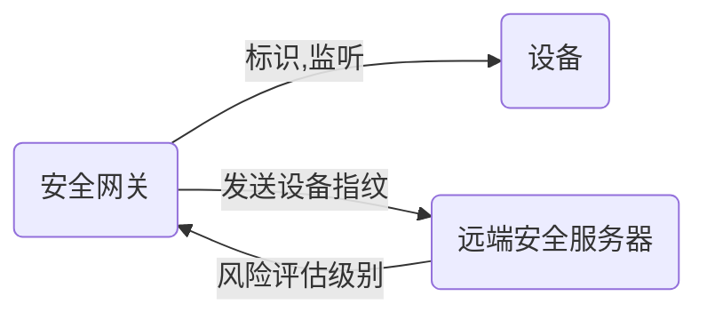
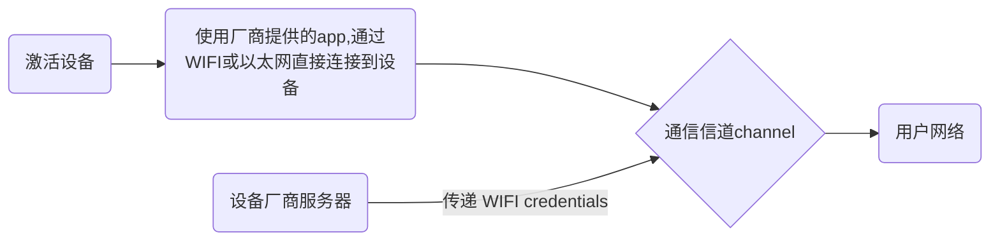

# IoT Sentinel

> "IoT Sentinel"（物联网哨兵）是一个术语，用于描述用于**监控、保护**和确保物联网设备身份的网络安全系统或解决方案。物联网哨兵通常是一个软件或硬件平台，旨在检测和应对物联网中的安全威胁、漏洞和攻击。
>
> 物联网哨兵的功能和特性可能包括以下内容：
>
> 1. 设备监控和漏洞检测：物联网哨兵可以监控物联网设备的活动，检测设备中的漏洞、弱点和异常行为，包括潜在的安全风险。
>
> 2. 数据流分析和实时监控：物联网哨兵可以对物联网设备生成的数据进行分析，检测异常模式和行为，以实时监测网络流量、事件和安全指标。
>
> 3. 认证和访问控制：物联网哨兵可以提供身份验证和访问控制机制，确保只有经过授权的实体能够访问和操作物联网设备和数据。
>
> 4. 威胁检测和应对：物联网哨兵可以实时监测网络中的威胁，并采取相应的措施来应对攻击、入侵和恶意行为，如阻断异常流量、隔离受感染的设备等。
>
> 5. 安全策略和配置管理：物联网哨兵可以管理和执行安全策略，包括设备的安全配置、更新管理、密钥管理等，以确保物联网设备的安全性和合规性。
>
> 总之，物联网哨兵是一个综合的安全解决方案，旨在提供保护和监管物联网设备和网络的安全性，并应对潜在的威胁和攻击。

论文目的：设计一个

- 能够自动识别IoT网络内设备类型
- 然后实施规则，限制脆弱设备通信的系统。

通过控制网络的流，来保护网络中的其他设备。

贡献

- 设计了一个对基于IP协议的IoT设备的，设备类型识别工具，并结合设备类型以及cve等数据库漏洞数据信息，对脆弱设备进行精确识别。

- 设计了一种框架：使用了基于软件实现的网络（SDN），隔离脆弱设备以及他发出的流量。

  > SDN（软件定义网络）是一种网络架构的范式，它通过将网络控制平面（control plane）和数据转发平面（data plane）进行分离，实现网络的灵活性、可编程性和集中化管理。
  >
  > 传统的网络架构中，网络设备（如交换机和路由器）通常同时负责控制平面和数据转发平面的功能。控制平面**处理路由计算、转发表维护等网络控制任务**，而数据转发平面负责实际的数据包转发。
  >
  > 而在SDN中，网络控制平面被抽象出来，并**通过一个中央化的控制器来管理整个网络**。控制器使用开放的接口与网络设备进行通信，并通过控制消息来指导数据包的转发行为。这样可以实现网络的集中管理和编程控制，并支持网络的自动化、灵活性和可扩展性。
  >
  > SDN的主要特点包括：
  > 1. **分离控制平面**和数据转发平面，提高网络的可编程性和灵活性。
  >
  > 2. 集中化的控制器，通过**控制消息**来管理网络设备。
  >
  > 3. 开放的接口和协议，促进网络设备的互操作性和创新。
  >
  > 4. 支持网络虚拟化和自动化，简化网络管理和部署。
  >
  >    - gpt3
  >      1. 虚拟网络划分：SDN可以将物理网络划分为多个逻辑上独立的虚拟网络。每个虚拟网络都有自己的网络拓扑、流量流向和策略控制，并可以与其他虚拟网络隔离。这样，多个租户或应用程序可以**共享物理基础设施**，同时各自的虚拟网络之间互不干扰。
  >      2. 逻辑隔离：SDN可以通过虚拟网络之间的隔离来提供安全性和隐私性。通过实施流量隔离、访问控制和策略管理，SDN可以**确保虚拟网络中的流量只能在所允许的范围内传输和访问**。
  >      3. 资源划分和调度：SDN可以根据不同虚拟网络的需求动态划分和分配网络资源。它可以根据流量负载、服务质量要求和策略规则，对带宽、延迟、优先级等**资源进行动态分配和调度**。这样可以实现网络资源的有效利用和性能优化。
  >      4. 灵活的网络服务和策略：SDN允许在虚拟网络中**自定义网络服务和策略**。通过控制器的编程能力，可以定义和部署特定的服务，如负载均衡、防火墙、流量引导等。这使得运营商、云服务提供商和企业可以根据自身需求定制网络服务和策略。
  >    - gpt4
  >      1. 将网络资源抽象到虚拟化系统中：SDN将网络资源抽象到虚拟化系统中，从而可以在物理拓扑上创建虚拟网络。这种虚拟化技术可以帮助企业更好地管理网络资源，提高网络的灵活性和可扩展性。
  >      2. 使用OpenFlow协议：SDN使用OpenFlow协议来实现网络虚拟化。OpenFlow协议是一种开放的网络协议，可以将网络控制平面和数据平面分离，从而实现网络虚拟化。
  >         - 在SDN架构中，控制平面是逻辑集中的，SDN通过某种协议将控制器与数据平面中的交换机进行通信，从而实现网络的控制和管理[2](https://mdnice.com/writing/3c6cd08797a04620a0fdff5cf8aa694b)。OpenFlow协议是SDN中最流行的南向协议之一，用于控制数据平面中的交换机[1](https://cloud.tencent.com/developer/article/1082902)。因此，网络控制平面和数据平面分离是SDN的特点之一，而OpenFlow协议是实现这一特点的重要手段之一。
  >      3. 使用P4编写包转发器：P4是一种可编程的数据平面语言，可以用于编写包转发器。使用P4编写的包转发器可以实现高度灵活性，从而实现网络虚拟化所需的高度灵活性。
  >      4. 使用Hybrid模式：一些SDN采用Hybrid模式来实现网络虚拟化，而非纯OpenFlow的方法。这些SDN除了支持OpenFlow外，还加入了JSON API、XMPP、Phyton API等，从而实现更高的灵活性和可扩展性。
  >
  > 5. 可以通**过软件定义的方式**实现网络服务的创新和快速部署。
  >
  > - SDN控制消息类型：
  >
  >   1. FlowMod：FlowMod消息用于添加、修改或删除流表规则。SDN控制器可以向网络设备发送FlowMod消息，以指示设备如何处理传入的数据流。
  >   2. PacketIn/PacketOut：PacketIn消息用于将网络设备接收到的未匹配到流表规则的数据包发送到SDN控制器。控制器可以对这些数据包进行处理，并通过PacketOut消息将处理后的数据包发送回网络设备进行转发。
  >   3. PortMod：PortMod消息用于配置和管理网络设备的端口。通过PortMod消息，控制器可以启用或禁用端口、配置带宽限制等。
  >   4. SwitchConfig：SwitchConfig消息用于配置网络设备的一般性设置，如设备的管理地址、QoS配置等。
  >   5. FlowStats/PortStats：FlowStats消息和PortStats消息用于向控制器报告流表规则的统计信息和端口的统计信息。这些消息允许控制器了解网络设备的流量和性能情况，并作出相应的调整或决策。
  >   6. BarrierRequest/BarrierReply：BarrierRequest消息用于控制控制器和网络设备之间的同步。当控制器发送BarrierRequest消息时，网络设备将等待直到完成其前一条消息的处理，并通过BarrierReply消息向控制器发送完成信号。
  >
  > - SDN协议类型：
  >
  >   1. OpenFlow：OpenFlow是最为广泛采用的SDN协议之一。它定义了控制器和网络设备之间的通信协议，包括消息格式、消息类型和消息交互过程。OpenFlow协议使用**OpenFlow消息来实现流表规则的下发、流量统计、端口状态管理**等功能。
  >
  >      - 流表规则的下发是指**SDN控制器将流表规则发送给网络设备**，以**指示设备如何处理数据包**。下发流表规则是将控制器的策略映射到网络设备，从而实现对网络流量的定制化管理。
  >
  >   2. NETCONF：NETCONF（网络配置）是一种用于网络设备配置的协议，也可以在SDN中用作控制消息的传输协议。NETCONF使用XML格式定义消息，并提供了一套操作和数据模型来对设备进行配置和管理。
  >
  >   3. RESTCONF：RESTCONF是基于RESTful风格的网络配置协议，它通过HTTP协议和Web服务接口传递控制消息。RESTCONF使用JSON或XML格式定义消息，具有灵活性和易于使用的特点。
  >
  >   4. gRPC：**gRPC是一种高性能的远程过程调用（RPC）框架，广泛应用于SDN中**。gRPC可以使用各种序列化格式（如Protocol Buffers、JSON）传递控制消息，并提供异步通信和流式传输等功能。
  >
  >   5. P4Runtime：P4Runtime是一种用于编程数据平面的协议，它与控制平面之间传递控制消息。P4Runtime使用Protocol Buffers（一种基于二进制编码的数据序列化机制，比json和xml更高效）定义消息格式，并提供了数据平面的编程接口和状态查询功能。
  >
  > SDN技术已经在数据中心、广域网和电信网络等各个领域得到广泛应用。它为网络提供了更高的灵活性、可管理性和可扩展性，并促进了网络的创新和进化。
  >
  > 使用SDN前，
  >
  > 
  >
  > 使用SDN后，根据不同产商结构不同，本文是基于Floodlight，因此显示他的示意图。
  >
  > > Floodlight是一款基于Java 语言的开源SDN 控制器，也使用了**层次化架构**来实现控制器的功能，同时提供了非常丰富的应用，可以**直接在网络中部署数据转发、拓扑发现**等基本功能。此外 Floodlight 还提供了友好的前端 Web 管理界面，用户可以通过管理界面查看连接的交换机信息、主机信息以及实时网络拓扑信息。
  > >
  > > Floodlight 通过**向 OpenFlow 交换机下发流表**等方式来实现数据分组转发决策，以达到对交换设备集中控制的目的。
  > >
  > > Floodlight 使用模块框架实现控制器特性和应用，在功能上 Floodlight 可看作**由控制器核心服务模块、普通应用模块和 REST 应用模块 3 个部分构成**。
  > >
  > > 其基本框架如下图所示：
  >
  > 

# 威胁以及系统设计

​		典型的IoT网络是由一个网关路由器（负责连接处理、数据处理、安全管理）和IoT设备，以及应用程序APP组成。网关路由器提供无线接口和有线接口，把支持IP协议的设备接入网络。

攻击方式：

- exfiltrate，渗透，对象包括数据、安全证书、秘钥

- compromise，威胁，控制其他网络内设备

- inject，向用户网络中注入虚假的/篡改的数据

  - 数据质量下降：虚假/篡改的数据可能会导致数据质量下降，从而影响数据的可靠性和准确性。

    例如，在电力系统中，虚假/篡改的数据可能会导致电力系统的状态估计出现错误，从而影响电力系统的稳定性和安全性[3](https://ieeexplore.ieee.org/document/8273736)[4](https://ieeexplore.ieee.org/document/8107314)。

  - 系统故障：虚假/篡改的数据可能会导致系统故障，从而影响系统的正常运行。

    例如，在医疗系统中，虚假/篡改的数据可能会导致医疗诊断和治疗出现错误，从而影响患者的健康和生命安全[5](https://casmodeling.springeropen.com/articles/10.1186/s40294-020-00070-w)。

  - 隐私泄露：虚假/篡改的数据可能会导致隐私泄露，从而影响个人和组织的隐私安全。

    例如，在金融系统中，虚假/篡改的数据可能会导致个人和组织的财务信息泄露，从而影响个人和组织的财务安全[2](https://crashtest-security.com/false-data-injection-attack/)。

  - 安全事件：虚假/篡改的数据可能会导致安全事件的发生，从而影响网络的安全性和稳定性。

    例如，在工业控制系统中，虚假/篡改的数据可能会导致工业控制系统的失效，从而影响工业生产的正常运行[2](https://crashtest-security.com/false-data-injection-attack/)。

IoT Sentinel运行流程：

1. 判断加入到网络中的新IoT设备的设备类型（本地网络）
2. 根据设备的设备类型，进行设备风险评估（安全服务器）
3. 根据风险等级，对设备通信能力进行限制（本地网络）

$$
设备类型 = 一个特定设备的模型model+版本号version
$$

> 设备类型判别根据：监视设备在配置阶段（setup）的通信行为，使用机器学习分类方法，产生设备的指纹。

系统主要由两部分组成：

- 部署在用户网络内的本地安全网关
- 以及由IoT安全服务供应商（IoTSSP）操作的远端IoT安全服务器

## 安全网关

​		安全网关，是基于SDN的流量监测和控制组件，在网络中**充当网关路由器和网络安全防护**的角色。网络中设备通过以太网或者wifi连接到网关。

- 无线设备通过Wifi Protected Setup（WPS）来获取设备唯一性证书。

  > WIFI protected setup是一种网络安全标准，使用户更简单的配置安全无线网络。
  >
  > WPS协议在 PIN 输入模式下，每台设备都需要唯一的 PIN（个人识别码）才能加入网络。 PIN 可以是设备上的固定标签或贴纸，也可以是生成并显示在设备屏幕上的动态 PIN。 用户将 PIN 输入路由器或接入点，然后路由器或接入点对设备进行身份验证并将其添加到网络。
  >
  > *WPS协议目前存在隐患*

- 证书使用WPA2 Pre-Shared Keys，用于设备在接入网关的无线接口时做认证。

  > WPA2是一种WIFI通信安全协议，提供数据加密和认证保护，以防止未经授权的访问和数据泄露。
  >
  > WPA2使用了一种名为AES（高级加密标准）的强大加密算法，用于加密无线通信中的数据。这一加密算法被认为是相对安全的，难以破解。此外，WPA2还提供了一种被称为802.1X的认证框架，允许使用不同的认证方法，如用户名和密码、数字证书或其他身份验证方式，以确保只有授权用户能够连接到受保护的Wi-Fi网络。

- 这样可以阻止本地攻击者进行身份冒充（forge/spoof/fabricate），以及窃听加密wifi流量，因为每个设备都有一个唯一的PSK（对于不支持WPS的设备，网关会在配置阶段为他分配一个设备唯一性的WPA2-PSK，便于统一管理）。

安全网关会对每一个设备进行标识，然后监视，**表征/描述每一个设备的行为**，最终形成设备指纹。然后把设备指纹发送到IoT安全服务器（IoT security service）进行认证和风险评估。然后，根据服务器response的隔离级别，由网关执行本地隔离。

## IoT 安全服务器

​		基于网关提供的指纹，IoTSSP使用机器学习分类，对不同设备类型的设备进行隔离级别划分。相比于传统的指纹识别方法，本方法**侧重于能表现设备行为的字段**，而不是在协议信息中的某些特殊字段进行划分。这允许模型不具备关于消息数据的语法，或者协议信息的先验知识。

​		对于训练数据的每一种设备类别，系统通过查询cve等数据库的漏洞报告来获取对应的危险级别信息。如果存在漏洞报告，隔离级别为restricted，否则为trusted，对于未知设备，划分为strict。

​		对于新设备，系统把他的指纹输入到训练模型中。安全服务器根据模型，得出对应设备类别的隔离级别，返回隔离级别给网关。

## 缓和措施

目的：在保持系统正常功能的前提下，尽可能最小化潜在危害。

> 网络隔离，安全网关把用户网络分为信任层和不信任层。
>
> 流量筛选，目的是阻止攻击者通过和脆弱设备通信，进行数据渗透和控制。流量筛选在网关上执行，可以通过针对特定协议或终端类别进行设备筛选，来减少对其他设备功能的影响。
>
> 用户通知，对于具有外部通信接口的脆弱设备，例如蓝牙或LTE connection，网关无法进行控制，需要人为地进行移除。

# IoT设备识别

## 设备指纹

​		设备指纹基于被动观测网络流量的方法。这种方法利用了IoT设备在接入家庭网络和网关时，会根据设备和厂商不同执行不同的步骤。这些步骤包含了一个**具有区分度的通信包序列**，也就是我们需要捕获的指纹原始数据。

​		相同的连续包删除后，最终得到的设备指纹是一个23×n的矩阵，每一行代表一个特征，每个特征由一系列**有序的包**组成。

23个特征序列如下：

这些序列都不依赖于报的具体内容payload，从而确保对加密流量的提取

- 二值特征位

  - 链路层协议，网络层协议，传输层协议，应用层协议，这些都是wifi设备常用的协议特征。当某层的某个协议被使用，就将特征向量的该位置1。
  - IP header中的可选字段，包括padding和router alert，也是通过置位的方式表示。

- 数值特征位

  - 包内容的大小，以及是否是原始数据包，即不包含任何协议头和尾的数据包（presence of raw data）

  - 目的IP地址，该字段映射到一个计数器（**记录通信实体的顺序**），每发现一个目的IP就+1。该字段用于记录在配置阶段，设备通信的实体，以及通信对象的顺序。

  - 最后一行用于表示通信端口，用映射的方法减少特征值数量
    $$
    no \quad port \quad\quad\quad\quad\quad\quad\quad\quad\quad⇒ f =0\\
    well-known\quad port \quad[0, 1023] ⇒ f =1\\
    registered\quad port \quad[1024, 49151] ⇒ f =2\\
    dynamic\quad port \quad[49152, 65535] ⇒ f =3
    $$
    

​		通过基于包序列形式的特征f={p1,...,pn}，可以提取通信的时间顺序关系，（先前的研究多是基于一段时间的包进行聚类）但这种方式导致了对于特征长度不相等的问题：因为指纹大小是可变的n。因此，构建F'，包含F的前12个不相同的包。连接起来形成一个276维的张量：
$$
F􀀁 = \{f_{1,1},f_{2,1},...,f_{23,1},f_{1,2},f_{2,1},...,f_{22,i},f_{23,i}\}
$$
对于不足12个独特包的序列，用0填充。

## 设备类型识别

为了能够在添加新设备时，保持可扩展性（scalable）和可用性（applicable），我们使用两步验证技术：

- 首先，对每一种独立的设备类型，训练一个单分类器，该分类器只对输入指纹是否是当前设备进行判断，返回二值结果0/1
- 未知设备会被多个单分类器识别，因此具有多个设备类型。对此，使用编辑距离选择最近的那个设备类别。

*由于编辑距离计算耗时，因此只用于混合分类结果的选择，不用于模型的单分类选择*

真简单啊

### 指纹分类

​		分类输入时固定特征长度的矩阵F‘。设备Di的分类器Ci的目的是训练一个模型，使Ci把识别的所有的设备Di作为一类，以及其他设备中的一个子集（平衡样布数量不均衡）作为另一类。使用随机森林来构建每种设备类型的Ci。

​		这种方法可以在面对新设备类型时，即被所有现有模型拒绝时，向森林添加新的分类器，而不是去适应预先训练好的多分类模型（其他方法所用的模型）。

### 编辑距离选择（Tiebreak）

对于匹配多个类型的指纹，会从每个设备类型中选择一个5个元素的子集，计算编辑距离。

我们把指纹F矩阵看做单词，每列看做一个字符。如果pi和pj的所有特征对应相等，则认为字符相等。然后对所有长度除以最长长度进行正则化，最终选择最低不相似度的类。

# 实现

安全网关通过软件定义的网络SDN来实施网络控制操作。我们写了一个基于Floodlight的SDN控制的自定义模块，用于执行

- 网络监控
- 指纹生成
- 处理和IoT安全服务器的通信
- 对连接设备实施网络访问限制，包括访问规则生成 和 对网络流实施安全规则

对于新接入设备，安全网关根据他在网络配置阶段的活动，生成指纹，然后发送到安全服务器，最后网关执行服务器发过来的隔离级别。

隔离级别：

- strict，只允许在untrusted层通信，不可接入网络
- restricted，只允许在untrusted层通信，只能访问有限的远端IP，例如生产商的云服务器。这些可访问IP在安全服务器发送隔离级别时一并发送过来，并在设备和安全服务器执行query时进行更新。
- trusted，随意访问

该模块可以拦截网络上的所有流量，确保流量都经过相应隔离接别的过滤。

基于每个设备的隔离级别，生成每个设备粒度的规则，能实现精确到每个流的，细粒度的流量过滤。把规则缓存在hash表中，来减少执行规则所储存缓存的扩张速度。

> 对于两个连接到同一个访问点的无线设备客户端，他们的通信是停留在客户端层面，不经过路由器层。因此，使用OpenWRT和Linux驱动，通过Open vSwitch把流量重定向（*模拟成外部对内部的通信，而不是内部自己的通信，这样就还是会经过路由表转发*），来**识别接在同一个访问点的无线接口上的设备**。这样就可以做到对无线设备的  设备-设备通信  进行流量过滤。

> OpenWRT是用于嵌入式设备的OS。通过使用OpenWRT，用户可以将普通的路由器转变为强大的、高度可配置的网络设备。
>
> OpenVswitch是虚拟交换机软件，用于虚拟化和管理计算机网络

# 测试

## 1.设备指纹收集

我们模拟IoT设备的配置过程，收集配置过程发出的包，建立分类模型。

- WiFi接入点：hostapd软件包模拟
- 外部的以太网接入点：连接到测试电脑上
- 包的捕获：在WIFI和以太网接入点上使用tcpdump
- 通过使用手机app来加速大部分厂商配置过的IoT设备的配置过程。

测试设备：

- 包括日常环境中的大部分设备，也包括使用WIFI和以太网以外的协议的设备。
- 例如使用Zigbee/Z-Wave协议，通过以太网或WIFI hub设备连接到家庭网络。这种情况下。我们专注于检测hub device的流量，而不是设备本身，因为我们对hub内部结构一无所知。（这就和IoT处理智能插座一样，测试时把插在上面的设备和插座视为整体，而不关系插座本身的行为流量）。

对于每种设备，重复20次安装过程，扩大训练数据量。每次测试后，通过硬重置是设备恢复原状。常见的安装过程包括：

## 2.设备识别

​		根据流量，获取特征矩阵F和对齐的矩阵F'，通过十折交叉验证（把数据分十分，重复十次），每一折都选择该设备的所有指纹F，以及随机数选择10倍的非该设备指纹作为另一类。

在选择效果更好的分类器后，使用编辑距离，对多标签F进行分类，最后使用检查验证十次，得到结果。

结论：除了最后十个正确率接近50，其他都接近100，均远高于随机的1/27。

- 问题出在同一厂商的相似设备上。例如D-Link的系列设备，同一厂商的咖啡机和水壶等等。
- 相似产品可能具有相同的硬件和固件版本，因此具有共同的弱点，即使无法区分也不会影响对设备的防护。

实验结果也从另一个角度说明了，我们可以区分同一厂商不同用途的产品。

表三显示了时间消耗，可见大部分时间都用在了编辑距离的计算上。

测试过程中，55%的指纹能匹配多个设备类型，每种设备大约需要执行六次tiebreak，而随机森林分类随规模线性变化，可以应对扩展到千种设备类型。

## 3.缓和措施实施

​		我们在OVS和SDN controller上同时运行Raspberry PI 2（小型单板计算机），来充当安全网关的角色。同时使用外部的USB WIFI 保护器（dongle）和hostapd来模拟单板计算机的无线网络接口。

​		对每个`设备指纹-设备类型`对，执行15轮测试。测量设备D1到Dn连接到安全网关无线接口的延迟，以及设备和服务器的通信延迟，如表4所示
$$
S_{local}指本地网络，S_{remote}指远端服务器
$$

说明了安全网关的使用，没有影响用户体验，即 未增加延迟。

图5.a表示了并行网络流数量增加对用户体验和延迟的影响：150个流以下，延迟增加不明显。

​		图5.b展示了CPU负载在使用流量过滤时没有明显增加，也表示进行流量过滤不需要CPU具有很高的处理性能。

​		图5.c类似，表明了使用流过滤不会明显增加内存。而且可以通过

- 控制规则缓存的大小
- 删除过期和无用规则

​		来控制规则存储所需的空间。增长比例如表5所示

# 相关工作

## A.安全的设备间通信

