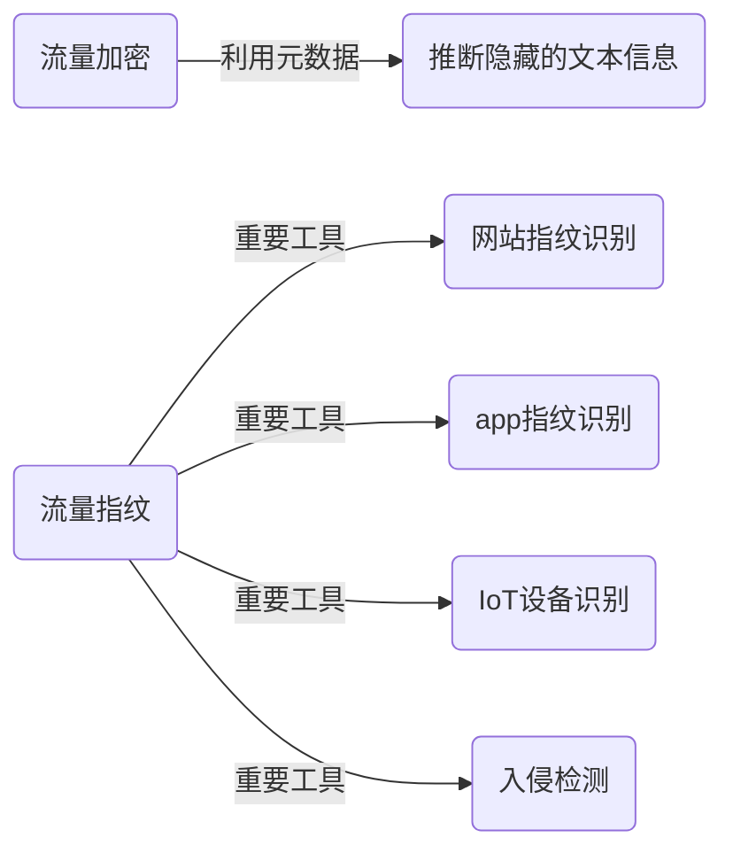
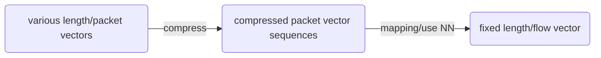

@[TOC](Input-Agnostic Hierarchical DL framework for Traffic Fingerprinting)

# Abstract

1. 深度学习对于自动提取特征、加密流量处理有诸多优势，但是也面临一些挑战。
2. 本文提出的任意输入（Input-Agnostic）网络，可以对多样化的流量进行分层抽象，然后直接输入到现有的神经网络模型中，用于执行后续分类任务。
3. 该模型主要处理流量的多样性（体现在raw packet的时间戳和大小信息）和网络对输入要求齐次向量（固定维度，矩阵运算）之间的矛盾。

# 1.Introduction

深度学习的缺陷

## Traffic Customization/流量定制

- 流量定制，即对多种不同的流量进行统一化处理，用于满足深度模型的统一输入格式：一个维数固定的向量。

- 之前的流量定制方法大多是通过流量裁剪（tailoring）：只用流量的一部分内容（例如，前面的元数据和header，加上前n个数据包）来作为网络输入。因为每个实验的网络结构都不同，因此裁减方案也就不同。

- 流量定制

  - 是标签密集的
  - 而且因为加入了大量的人工干预，**影响了流量本身的特征**。
  - 同时会让网络对定制方法敏感（不同的定制策略会不同形式的丢失一部分数据）

- 尽管RNN允许输入一系列**不同长度**的向量序列来表示一个流量样本，但要求这些向量都是**相同维度的**，而且结构相同的。

  - **输入向量可以不同长度：** 这意味着你可以将不同长度的序列输入到RNN中，而RNN可以有效地处理这些不同长度的序列。例如，你可以将一个包含5个单词的句子和一个包含10个单词的句子都输入到同一个RNN中进行处理。

  - **必须相同维度：** 这表示不同序列中的每个元素（例如，单词或时间步）的特征维度必须相同。例如，如果你在一个序列中使用100维的词嵌入表示单词，那么在另一个序列中也必须使用相同的维度，即100维。

  - **结构相同：** 这意味着不同序列之间的结构必须相似。例如，如果你使用一个特定的RNN架构，那么在所有输入序列中，<u>RNN层的结构（例如，隐藏单元的数量和层级）应该相同</u>。

    > RNN（循环神经网络）的一个重要特点是它们能够处理序列数据，而这些序列数据的长度可以不同。这是因为RNN中的循环结构允许网络在处理输入序列时**保持状态**，使其能够动态地适应不同长度的序列。

    > - 在 RNN 中，状态保持是一个重要的概念。RNN的循环结构允许它们保持一个内部状态，这个状态会随着每个时间步的输入而更新。这个**内部状态充当了网络对之前观察到的信息的记忆**，因此它能够捕捉序列数据中的**上下文信息**。
    > - 这个内部状态在每个时间步都会更新，以便传递信息和记忆到后续时间步。这种状态保持机制是 RNN 能够处理序列数据的关键特性之一，它使网络能够捕捉长期依赖关系和上下文信息。
    > - 通常，RNN 的状态保持会通过循环神经元（如 LSTM 或 GRU）中的隐藏状态来实现。这个隐藏状态在每个时间步都会更新，将当前输入与之前的状态结合起来，以生成新的状态。这允许网络记住之前的信息，并将其传递到未来的时间步。
    >
    > RNN之所以强大，是因为它们适用于许多不定长的序列数据，如自然语言文本、时间序列数据、音频信号等。通过动态适应不同长度的输入序列，RNN使得神经网络能够处理各种不同的任务，包括自然语言处理、语音识别、机器翻译等。

  - 对于过长的输入向量（或者处理序列特征时），RNN会出现优化过程中的梯度消失问题原因如下：

    > 1. **循环结构：** RNN 的核心特点是其循环结构，每个时间步的隐藏状态都依赖于前一个时间步的隐藏状态。这意味着权重矩阵会多次相乘，导致梯度在反向传播中多次相乘，可能会缩小到接近零。
    > 2. **Sigmoid 或 Tanh 激活函数：** 传统的RNN中通常使用 Sigmoid 或 Tanh 激活函数，它们的导数在某些区域非常小，导致梯度的快速衰减。
    > 3. **长序列：** 当RNN处理长序列数据时，梯度传播的问题更为明显，因为梯度会多次传播，每次都可能缩小。
    >
    > 为了应对梯度消失问题，出现了一些改进的RNN变体，如长短时记忆网络（LSTM）和门控循环单元（GRU），它们使用了更复杂的结构和门控机制，有助于缓解梯度消失问题。此外，使用适当的权重初始化方法、梯度剪切（gradient clipping）和注意力机制等技术也有助于改善RNN的训练。
    >
    > 总的来说，梯度消失问题不仅仅是RNN所特有的，但由于其结构的特点，它在RNN中更为显著。

- 因此，流量定制任务总需要对流量进行复杂度、不具有普适性的预处理工作。

## Hierarchy Unawareness/无层次感知

- 对于给定的网络活动行为，流量特征会以层次的形式存在于每一个独立的包和所归属的流数据之间。这些层次信息反映了包之间的关系，同样的，trace也包含了flow之间的关系。但目前的深度学习方法缺少对这些特征提取的机制。（例如，来自同一个ip和端口的TCP/UDP数据包）

  > *层次关系是通过在数据包的不同层级中添加不同的标识信息来实现的*
  >
  > 每个层级的数据包会在其头部或负载中包含有关该层级的信息，以便在接收端逐层解析和处理。这些不同层级的标识信息是用来确保数据在网络中能够正确传递和到达目标地点的关键部分。所以，通过在不同层级中添加不同的标识信息，实现了数据包的层次关系。

- 举例来说，一个用户访问网站，产生多个不同的**HTTP连接**。每个HTTP连接产生多个变长的TCP trace，每个trace包含多个不同长度的flow，每个flow包含多个变长的packet。目前的深度学习方法直接根据包到达的顺序，把流量展平成一个**齐次向量序列**，输入到分类模型中。这种方法会丢失上层的包之间的关系，即使输入数据标注了那些包属于哪一个流。

- > 一个HTTP连接可能包含多个流量跟踪（traffic traces）的原因有多种，主要取决于连接的性质和用途。下面是一些常见的情况：
  >
  > 1. **分段传输（Chunked Transfer）：** HTTP响应可以采用分段传输的方式，响应数据被分成多个块（chunks）发送，每个块后面都有一个标识这个块大小的头部信息。这意味着在一个HTTP连接上，数据会分为多个流量trace，每个trace对应数据的一个块。
  > 2. **多个HTTP请求和响应：** 在一个HTTP连接上，客户端可以发送多个HTTP请求，而服务器也可以发送多个HTTP响应。这些请求和响应可以同时存在于同一个连接中，形成多个流量trace。
  > 3. **长连接（Keep-Alive）：** HTTP 1.1 引入了持久连接（Keep-Alive）的概念，允许多个HTTP请求和响应共享同一个连接，而不需要为每个请求和响应都建立和关闭连接。这样，多个HTTP请求和响应可以在同一个连接中传输，形成多个流量trace。
  > 4. **并行请求：** 现代Web页面通常包含多个资源，如图像、CSS、JavaScript等。浏览器可以并行地请求这些资源，从而多个请求可以同时传输在一个连接上。
  > 5. **多路复用（Multiplexing）：** HTTP/2 引入了多路复用的特性，它允许多个HTTP请求和响应在同一个连接上同时传输，而不会相互干扰。这意味着在一个HTTP/2 连接上，可以有多个并行的流量跟踪。
  
- > 一个HTTP连接包含多个流量 trace 和一个 trace 包含多个 flow 的原因有些相似，但它们的概念和作用稍有不同
  >
  > 1. **HTTP连接包含多个流量 trace：** HTTP连接通常不是一次性完成的，而是涉及到多个HTTP请求和响应。每个HTTP请求和响应之间可能存在一些时间间隔，例如在浏览网页时，浏览器会连续请求多个资源（如HTML文件、CSS文件、JavaScript文件、图像等），**每个请求和响应都构成了一个独立的流量 trace**。这些 trace 代表了一个HTTP连接的不同部分。
  > 2. **trace 包含多个 flow：** 在网络中，flow 通常是指网络数据包从一个源到目标的一组通信。一个 trace 中可以包含多个 flow 的原因是因为在一个HTTP请求/响应交互中，**数据可能经过多个不同的网络路径**（流），这可能包括代理服务器、负载均衡器、CDN（内容分发网络）等。每个不同的网络路径都可以构成一个 flow。这些 flow 通常是同一 trace 中不同部分的一部分。
  >
  > 涉及到网络通信的多样性和复杂性
  >
  > - HTTP连接通常涉及多个请求和响应，每个请求和响应形成一个流量 trace。
  > - 一个 trace 中可能会包括多个 flow，表示数据在不同网络路径上的传输。
  
- > 齐次向量（homogeneous vector）是指在其原始分量之后附加了一个额外组成部分（通常设置为1）的向量。这个额外的部分被称为齐次坐标。在数学和计算机图形学中，齐次坐标用于表示投影空间中的点，通过添加无限远处的点来扩展仿射空间。<u>通过在原始坐标添加一个额外的维度，并将齐次坐标设置为1（或任何其他非零值），可以表示无限远处的点，并且可以将某些操作（例如平移和透视变换）表示为矩阵乘法。</u>
  >
  > 例如，在二维齐次坐标中，一个点 (x, y) 被表示为 (x', y', w')，其中 x' = x/w，y' = y/w，w' = 1。齐次坐标 w' 允许表示无限远处的点。
  >
  > - 当原始数据被展平为齐次向量时，**原始数据中的结构和顺序信息都会丢失**。这样，上层包关系（例如数据包的顺序、持续时间、相对位置等）将不再可见。
  > - 展平操作将数据转换为一维的、结构简单的向量，**其中所有特征具有相同的重要性**，而忽略了它们在原始数据中的上下文信息。

- 综上所述，本文设计了一个可以处理任意输入的、有层次感知功能的框架，用于**处理流量指纹识别的深度学习输入问题**。

  - 目的1，支持多种形式的流量输入，同时减少每种流量识别任务所需要的**流量定制开销**。
  - 目的2，设计内部模块，用于支持流量识别与分类任务中，对**特征的层次化描述**。

- 基本思想：设计一个能够根据不同输入，学习流量特征的跨层流量模型（packet-flow-trace）

  - 通过使用reduce的流量定制，来支持变长的包数据输入。

    > *reduced task-by-task traffic Customization，把流量的层次信息以额外字段的形式添加到原始流量中*

  ```python
  # mylib的pre_process系列函数
  # 添加顺序信息
  id_pad = min(i_vector / 100, 1)
  train_data[i][0][i_vectors][i_vector] = np.r_[
      train_data[i][0][i_vectors][i_vector], id_pad]
  
  # 添加时间信息
  if i_vector >= 1:
  	time_sum = dataset[i][0][i_flow][i_vector][0] + \
      			dataset[i][0][i_flow][i_vector - 1][-1]
      dataset[i][0][i_flow][i_vector] = \
      		np.r_[dataset[i][0][i_flow][i_vector], time_sum]
  else:
      dataset[i][0][i_flow][i_vector] = \
               np.r_[dataset[i][0][i_flow][i_vector], 0]
  ```

  - 设计专门为流量领域深度学习分类任务设计的内置机制，允许在流量指纹提取任务中获得层次画的特征描述信息。

# 2.Background and problem description



除了上述应用场景，流量指纹的目的是根据有意义的标签，对流量trace进行分割。

攻击方法

> ​		对于能截取终端和服务器流量的攻击者，他想要获取设备访问的网站列表。那么他可以通过脚本收集使用同一个协议的，这些网站的流量trace，训练分类器，然后部署到想要窃听的用户上，从而获取发往指定网站的流量。

- 一个流量trace包含一次网站访问中产生的一个不等长包序列。这些包来自不同的flows，通过ip和端口号区分。**每个流负责传输不同的资源**（.html，.jpg，.mp4），因此在特征上都不相同（序列长度，包大小，到达时间）。
- 

trace内部不同的流量类别和特征类别，与统一的向量表示产生冲突，导致了流量定制和层次信息消失的问题。

# 3.framework design


- 输入：trace X，包含多个不同的flows。（flow = packets sharing the same communicating IPs and ports）
- 输出：X对于不同类别的概率分布。


- 为了能提取层次信息，将网络化分为三层，以自底向上的结构组织。
  - 最底层的packet layer直接对包数据读取，不执行traffic tailoring（+-数据包）
  - 最顶层的trace layer 直接连接到NN，用于执行后续分类任务。
  - 通过直接读取trace数据，而不是一系列齐次化后的向量，使得模型能够读取trace的层次信息和原始大小，同时省去流量定制的开销。
- 前两模块工作在对应的layer，后两个都工作在trace layer。

## M0:Packet Vectorization

- 把一个包转换成一个向量PV，只需要把包数据和元数据中有用字段结合，包括包的时间戳，大小

- 处理后

  ```mermaid
  graph LR
  id1(模型外/同一个flow的包序列) --Vectorization-->id2(模型中/packet layer的包向量序列)
  ```

- 前面的pre_process系列函数代码，就是对应的生成packet Vectorization的过程。

  > 与特征提取的区别：这个过程只是尽可能多的把元数据包含的特征和包本身拼接到一起，组成可输入到下一个模块的向量，也可以叫张量tensor。而特征提取时结合多种不同的字段，结合先验知识，人为构造一个能表示设备行为的向量。

  ```json
  [[[[[[0, 1], [1, 1], [2, 1]]], 0]],[0, 1]]
  // Vectorization后的packet，即每有一个有用的先验知识或元数据，就对原始数据封装一层tensor。形成逐层嵌套的张量
  ```

- packet vector的公式表示
  $$
  PV_i=<s_i,(t_i-t_0),(t_i-t_{i-1}),i,i/k))>\\
  t_i-t_0,(t_i-t_{i-1})分别表示到第一个数据包和前一个数据包的时间间隔，\\令t_0=t_1表示开始状态,
  i/k表示p_i在flow中的相对位置
  $$

  ```python
  # mylib的pre_process系列函数
  # 添加时间信息
  if i_vector >= 1:
  	time_sum = dataset[i][0][i_flow][i_vector][0] + \
      			dataset[i][0][i_flow][i_vector - 1][-1]
      dataset[i][0][i_flow][i_vector] = \
      		np.r_[dataset[i][0][i_flow][i_vector], time_sum]
  else:
      dataset[i][0][i_flow][i_vector] = \
               np.r_[dataset[i][0][i_flow][i_vector], 0]
  ```


*这里输出的vectors仍然是变长的*

## M1:Packet-to-flow Mapping

把packet-layer信息抽象化，传输到flow层



- compress的目的是提高映射性能，经compress后的PV用CPV表示。

### Packet Vector Sequence Compression

- 为了解决过长的packet vector，使用CNN对长包序列进行压缩。*三个c_convx开头的层就是用来进行向量压缩的，对应代码的标志位`self.cfg.PACKETCNN`*。
  - 压缩不仅是缩短Packet Vector的长度，还可以线性减少Packet Vector的数量，减少后续映射操作的开销。
  
  - 使用多个卷积层来处理输入，可以增加神经网络的拟合能力，减少训练epoch数。
  
    > 假设数据包向量长48，不压缩则输入长度为48的CPV sequence。如果使用三个卷积层，每层跟一个步长为2的池化层，那么输入长度为6个CPV。此时对于不足8个packet的flow使用0填充。
  
- 使用CNN进行序列压缩，可以**减少开销，同时继承了CNN捕获本地特征的能力**。

### Neural Network Structure Construction

- 使用四种网络结构进行mapping测试
  - 链式结构的循环神经网络，iterative
  - 基于平衡二叉树的树结构循环神经网络，parallel
  - 权重缩放+点积+注意力机制的神经网络，selective abstraction mechanisms
  - 混合神经网络

#### 链式结构

顺序处理输入，遵循迭代的思想。


- h3即使输出的flow vector，链式结构的目的是，**寻找packet vector的线性依赖性**。
- 实现方式
  - classic RNN，但是反向传播时有梯度消失问题。
  - LSTM和Gated Recurrent Unit结合，可以缓解梯度消失问题。但问题仍存在，例如，上图中在进行参数优化使，PV1对梯度的影响往往小于PV3。而且只有TSTM和GRU结合能提高效率，别的模型都是降低效率。
  - BiLSTM，双向LSTM。这种方法使得参数传播途径减半，可以大大缓解梯度消失问题。
- 使用BiLSTM，输出双向的隐层状态之和（将每个时间步的前向隐层状态和后向隐层状态相加来形成最终的输出）。

#### 树结构/Balanced Binary Tree RNN


- CPV在叶子结点上，不断bottom-top向上计算，输出在根节点。
- 叶子结点的计算可以是并行的。
- 假设输入sequence长度为N，那计算复杂度为O(logN)，输入和输出之间的**路径长度也为logN**，远小于N，因此不会出现梯度消失问题。

#### 注意力结构

> 在注意力机制中，特征选择的关键在于计算注意力权重，即为每个特征分配一个权重，以指导网络对不同特征的重要性进行加权。
>
> 一种常见的注意力机制是自注意力机制（Self-Attention），用于捕获序列数据中的关联信息。
>
> **自注意力机制通过计算查询、键和值的关联度得分，并对值进行加权求和来选择特征**。具体的过程如下：
>
> 1. 查询（Query）（注意力权重尺）：根据**模型的当前状态或上下文**生成的，用于指定模型**关注的内容**。查询决定了在输入数据中哪些部分应该受到更多的关注。查询向量与键向量进行内积运算，以生成与输入数据的不同部分相关的注意力分数。查询向量充当了一种标志或指导，帮助模型确定关注的焦点。
> 2. 键（Key）（输入编码）：是从输入数据中派生的。**键向量与查询向量（的转置）进行内积运算，以生成注意力分数**。关键的作用是将查询与输入数据的每个部分相匹配，以确定每个输入部分的相关性。键向量可以看作是**输入的编码**，用于标识输入中的不同信息。
> 3. 值（Value）：值是与输入数据的每个部分相关联的向量。值向量与查询和键的注意力分数相乘，以生成**最终的加权和**，这表示了模型关注的内容。值向量通常包含有关输入数据的实际信息或特征。值的作用是根据查询和键的权重来计算模型的输出，以反映模型对输入的不同部分的关注程度。
> 4. 关联度得分（Attention Score）：计算查询向量与各个键向量之间的关联度得分，通常使用点积、加权点积或其他方式计算得到。
> 5. 归一化（Normalization）：将关联度得分通过 softmax 或其他归一化方式转换为注意力权重，以确保各个权重的总和为 1。
> 6. 特征加权求和：**将注意力权重与对应的值向量进行加权求和**，得到最终的特征表示。
>
> 通过以上过程，注意力机制神经网络能够根据输入特征之间的关联度，自动学习选择重要的特征进行加权，从而更聚焦地表示输入的信息。这种机制能够捕捉输入中不同特征之间的依赖关系，从而提高模型在处理复杂问题时的表达能力和性能。
>

和前两者不同，注意力机制可以不用提前定义输入包序列的处理顺序，而是选择性的从CPVs中提取关键特征。选择标准就是注意力权重，也是模型训练中的参数之一。

#### 混合结构

> 混合结构的神经网络一般指的是同时包含了卷积层和全连接层（或其他类型的层）的神经网络结构。并行执行混合结构的神经网络可以通过以下几种方式实现：
>
> 1. 层级并行（Layer-level parallelism）：将神经网络中的不同层分配给不同的计算设备进行并行执行。可以将卷积层和全连接层分配给不同的设备，然后在计算过程中将它们的输出进行通信和组合。这种并行方式适用于层之间的计算独立性较高的情况。
> 2. 通道并行（Channel-level parallelism）：将混合结构中的卷积层的不同通道或全连接层的不同节点分配给不同的计算设备进行并行执行。每个设备负责计算部分通道或节点的输出，并将它们的输出进行通信和组合。这种并行方式适用于卷积层通道数较多或全连接层节点数较多的情况。
> 3. 数据并行（Data parallelism）：将输入数据划分为多个批次，并将每个批次分配给不同的计算设备进行并行处理。每个设备独立计算自己的批次，并将它们的计算结果进行通信和组合。这种并行方式适用于大规模数据集的处理情况。
> 4. 模型并行（Model parallelism）：将混合结构中的不同部分（例如卷积层和全连接层）分配给不同的计算设备进行并行处理。在计算过程中，涉及到多个设备的数据进行通信和组合。这种并行方式适用于神经网络模型过大，无法完全适应单个设备的情况。

- 并行/串行融合多个网络，并行结合的神经网络可以分别计算输出，然后合并。
- 本文结构：**串行链接的链式结构BiLSTM+注意力机制网络**。
  - 输入数据经过链式结构网络，输出二次输入到注意力网络，得到最终输出。

## M2:Flow-to-trace Mapping

和M1使用相同网络

## M3:trace-to-label Classification

经过两轮映射，把不同长度的packet vector映射到flow vector，再把不同数量的flow vector映射到trace vector。

最后使用分类器，使用多个线性层，softmax激活函数，预测trace所属的类别。

# 4.Evaluation

## 4.1 Datasets and Tasks

### 4.1.1 user activity fingerprinting

对应数据集UAV，包含五种不同的活动（观看视频、批量瞎子啊、空闲、浏览网站和交互操作），每个持续 1 到 3 小时。按照 轨迹为按照5秒的时间窗口划分。

- 数据集包括通过网络流量、传感器和移动设备等方式收集的用户活动数据，例如浏览网页、播放音乐、使用应用程序等[1](https://www.sciencedirect.com/science/article/pii/S1389128620312081)[5](https://arxiv.org/pdf/2105.13698.pdf)[7](https://www.ncbi.nlm.nih.gov/pmc/articles/PMC10425662/)[8](https://www.cis.fordham.edu/wisdm/dataset.php)。
- 数据集中的用户活动可以通过机器学习算法进行分类和识别，例如基于网络流量的分类算法和基于手机加速度计的活动识别算法[1](https://www.sciencedirect.com/science/article/pii/S1389128620312081)[5](https://arxiv.org/pdf/2105.13698.pdf)[8](https://www.cis.fordham.edu/wisdm/dataset.php)。
- 数据集中的数据可以用于多种应用，例如移动设备行为分析、交通出行分析和用户活动识别等[7](https://www.ncbi.nlm.nih.gov/pmc/articles/PMC10425662/)。

### 4.1.2 Internet of Things (IoT) device identification

IDI数据集，27 种不同设备, 每种设备有大约20个trace，数据来自设备setup阶段的流量，代表 27 种不同类型的 31 个智能家居物联网设备（4 种类型分别由 2 台设备代表）设置过程中发出的流量。 每种设备类型的每个设置至少重复 20 次。
每个目录包含多个 pcap 文件，每个文件代表给定设备目录的设置。 文件名为 Setup-X-Y-STA.pcap，其中 X 是实现设置的人员，Y 是给定捕获的序列号。 文件 _iotdevice-mac.txt 包含所考虑的 IoT 设备的 MAC 地址。

### 4.1.3 intrusion detection

ETF IoT 僵尸网络（Botnet）数据集，包括正常流量和恶意软件流量。 正常流量会在个人计算机上记录几个小时，恶意软件流量是在 Raspberry Pi 设备上捕获的。还收集了两个对用户隐私构成威胁的任务的专有数据集：：Shadowsocks 网站指纹和关键字搜索指纹。

## 4.2 Framework setting

训练参数，网络结构，CNN 压缩，过拟合处理。

### 4.2.1 默认配置

在两个mapping模块中使用CNN压缩和混合神经网络结构，权重递减，早停，batch normalization来解决过拟合。

### 4.2.2 训练加速

使用batch normalization来加速训练。基本思想是把隐层的输入正则化，方法是把特征分布转化成正则化分布。考虑到隐层输入可能有不同长度，因此我们只在模型最后的全连接层上进行BN。对整个层进行正则化，而不是对向量进行正则化。


### 4.2.3 网络结构


可见第一个模块在各个模型上效果差不多。


混合模型的平均得分更高，因此选择混合模型。


使用CNN compression对于模型的精度影响不大，但可以节约80-90%的时间和50%的内存。

### 4.2.4 处理过拟合

本模型使用辅助损失函数Auxiliary Loss(AL) 和数据增强Data Enhancement (DE)的方式来处理过拟合。

1. Auxiliary Loss

> Auxiliary loss（辅助损失）是在深度学习中用于防止过拟合的一种正则化技术。它的工作原理是通过向神经网络的损失函数中添加额外的损失项，来约束模型的参数，使得模型更容易泛化到新的数据。
>
> 以下是一些关于辅助损失防止过拟合的方式：
>
> 1. **增加模型复杂性：** 辅助损失增加了模型的复杂性，使其能够更好地拟合训练数据。它为模型提供了额外的学习目标，以更好地捕获数据中的结构和特征。
> 2. 多任务学习： 辅助损失通常与多任务学习有关，即模型不仅要执行主要任务，还要执行辅助任务。这可以迫使模型学习共享特征，使得不同任务之间的特征提取变得通用，从而提高模型的泛化性能。
> 3. 减少过度拟合：辅助损失在训练期间增加了对不同任务或数据集的约束，从而减少了模型过度拟合训练数据的风险。模型需要适应多个任务，而不是过于专门化于单个任务。
> 4. 正则化作用： 辅助损失可以被看作是一种正则化项，它与主要任务的损失项一起优化。正则化有助于控制模型参数的复杂性，从而减少了过拟合的风险。
>
> 需要注意的是，辅助损失并不总是适用于所有情况。它需要谨慎设计，以确保与主要任务之间存在相关性，并且能够在训练过程中提供有益的信息。不正确或不恰当的辅助损失可能会导致模型性能下降。

- 通过给模型**提供先验知识**的方式来阻止过拟合。除了关于trace training的信息，我们额外加入**关于flow Classification的辅助信息**。对flow进行正确划分后，也能促进对trace的正确分类，因此是对结果有效的。

- 我们通过在网络中加入额外前向路径的方式来实施，流程如下图虚线所示

- 

- 在获取flow vectors之后，我们为每个流额外加入一个**它所属trace**的标签。

  在执行trace分类之前，对一个trace内的**每个flow**额外做一次分类预测，然后用预测结果和我们给的标签计算误差。由于每个流的flow数量不同，采用正则化，最后损失函数如下：

$$
Loss= CrossEntroty(P,\Lambda)+\sum_{i=1}^{N}\frac{1}{N} CrossEntroty(P^{'}_{i},\Lambda)\\
损失由迹分类损失函数和流分类损失函数组成\\
P是我们给的，预测的trace label;\\P^{'}_{i}是第i个flow给出的预测结果，\Lambda是真实流标签\\
$$

2. 数据增强/Data Enhancement

- Cropping，随机从原trace中切掉一部分
- dropping，以一定概率随机丢掉一部分包
- noising，在包的时间字段上，随机添加噪声

```python
def data_enhancement(self, X):
    if self.cfg.PACKET2FLOW == '2dCNN':
        return X  # not ready yet

    if self.cfg.PACKET2FLOW == '1dCNN' and self.cfg.SCALE_1dCNN:
        return X  # not ready yet

    X_new = copy.deepcopy(X)

    for i_flow in range(len(X_new)):
        for i_vector in range(len(X_new[i_flow])):
            X_new[i_flow][i_vector] = X_new[i_flow][i_vector][0:2]

    rand_num = random.random()

    if 0.5 < rand_num < 0.7:
        # 随机丢弃包
        for i_flow in range(len(X_new)):
            for i_vector in range(len(X_new[i_flow]) - 1, -1, -1):
                rand_threshold = random.random() * 0.1
                if random.random() < rand_threshold:
                    del X_new[i_flow][i_vector]

    if 0.7 < rand_num < 0.8:
        # 时间平移（保序），当初向量化的时候，选择的第一个就是时间，所以就用[i_vector][0]来获取时间戳
        for i_flow in range(len(X_new)):
            for i_vector in range(1, len(X_new[i_flow])):
                if i_vector == len(X_new[i_flow]) - 1:
                    max_size = X_new[i_flow][i_vector][0] / 2
                    random_biaos = (random.random() * 2 - 1) * max_size
                    X_new[i_flow][i_vector][0] -= random_biaos
                else:
                    max_size = min(X_new[i_flow][i_vector][0], 
                                   X_new[i_flow][i_vector + 1][0])
                    random_biaos = (random.random() * 2 - 1) * max_size
                    X_new[i_flow][i_vector][0] -= random_biaos
                    X_new[i_flow][i_vector + 1][0] += random_biaos

    if 0.8 < rand_num < 1:
        # 前后随机cut
        max_time_list = [max([X_new[i_flow][i_vector][0] 
                              for i_vector in range(0, len(X_new[i_flow]))]) 
                         for i_flow in range(len(X_new))]
        max_time = max(max_time_list)

        startcut = (random.random() * 0.2) * max_time
        endcut = (1 - random.random() * 0.2) * max_time
        for i_flow in range(len(X_new) - 1, -1, -1):
            for i_vector in range(len(X_new[i_flow]) - 1, -1, -1):
                if X_new[i_flow][i_vector][0] < startcut or 
                	X_new[i_flow][i_vector][0] > endcut:
                    del X_new[i_flow][i_vector]
            if len(X_new[i_flow]) == 0:
                del X_new[i_flow]
```

3. 混合方法H-*

Early Stopping (ES) , Weight Decay (WD) , Dropout (DO) , Batch Normalization (BN) 进行混合。

> 不同时使用Dropout 和Normalization
>
> dropout属于正则化方法，通过随机地将一些神经元的输出置为0，以减少模型的过拟合风险。
>
> batch normalization属于归一化方法，用于将每个特征的值归一化到均值为0、方差为1的范围内，以提高模型的稳定性和收敛速度。
>
> 当dropout和batch normalization结合使用时，dropout会导致某些神经元的输出方差发生变化，而batch normalization会保持其输出方差不变，从而导致神经方差的不一致行为，即variance shift。这种不一致行为会导致模型在测试阶段的表现不稳定，从而影响模型的性能。

我们进行排列组合，然后对每种混合方法，和单一方法进行比较，选择提升最多的混合方法。


从上表可见，

- 在纯粹方法处理过拟合中，Batch Normalization效果最好
- H方法去掉Batch Normalization后，损失最大
- H方法均好于纯粹方法

## 4.3 测试结果

### 4.3.1 与当前模型对比

与当前网络结构（SOTA，state-of-the-art）相比，五种任务的F1-score对比。


结论

- 论文模型的统一化表示，不仅减少了针对特定任务的流量定制开销，而且我们的模型支持在小数据集上得出较好结果（KWF只有50类的5000个trace）。

- 我们的模型只用了数据包元数据中的包长和时间戳来进行包的向量化，这些特征是加密流量几乎都具备的元数据。如果有额外数据支持，那么可以进一步提高packet阶段的分类效率。

  例如，使用raw packet的IDI数据集，我们直接把每个packet的应用层数据映射成packet vector，也可以实现包的embedding，以支持后续模块的分类任务。

### 4.3.2 特征可视化

使用t-SNE method，实现非线性特征降维。本模型通过降维成二维数据，实现特征可视化。

trace vector和对应的分类结果如下图所示。


下两张图展示了影响分类结果的可能因素。通过注意力机制，对每个trace中，flow和packet的重要性进行可视化，得出结论：较长的flow和flow的前几个packet更容易成为分类标准/吸引分类器注意。


### 4.3.3 不设置Traffic Customization的好处

> TC-1，把flow裁剪到固定长度，使用BiLSTM+注意力网络
>
> TC-2，把flow裁剪到固定长度，把模型的M1模块替换成1dCNN
>
> TC-3，不对流进行裁剪（流长度任意），把模型的M1模块替换成1d-scaling和1dCNN
>
> TC-4，不对流进行裁剪，把模型的M1模块替换成2d-希尔伯特曲线曲线-scaling和2dCNN

无论是哪种方案，对于流的tailoring都发生在packet Vectorization之前。即先对流进行切分，然后再向量化packet，这样做的目的是使第一模块可以替换成CNN。

> 为了能够保留流的层次特征，M2及以后层保留原结构。

希尔伯特曲线可以把一位数据映射到高维空间（和tSNE相反），本模型中是把一个flow的packet vector sequence映射成一张图像。使用时，把所有的sequence scale到长度256，输入曲线函数。


使用不同的百分比来进行flow tailor。

> TC-1中，tailoring选择的的标准流长度过长，会导致大量填充0，从而使F1下降，直到不限制流长度，即不适用tailoring时最好。
>
> TC-2中，和1相似的问题，且因为缺少流量定制，表现更差。
>
> TC-3中，当我们采用流量定制时，我们允许M1模块采用其他实现方式，以实现更高的分类精度。
>
> TC-4中，类似于3，对另一种M1模块进行尝试。

对于某些数据和任务，预先知道前几个包含有重要信息时（例如IDI的flow的前两个包包含关于设备类型信息的明文，对分类有很大作用），使用flow tailoring 可以提高效率。

> 1. Flow Tailoring（流量定制）：
>
>    Flow tailoring通常指的是通过对整个分类流程进行调整和优化，以确保网络流量分类模型能够更好地满足特定需求。这可能包括选择适当的神经网络结构，调整超参数，进行数据预处理和增强，以最大程度地提高流量分类性能。Flow tailoring是一个更高级别的概念，通常用于优化整体分类任务。
>
> 2. Flow Customization（流量定制）：
>
>    Flow customization更多地强调对特定流量类别或情景的深度个性化定制。这可能包括针对某些流量类别的特定模型或规则的设置，以确保这些流量得到准确的分类。例如，对于特定应用程序、威胁检测或合规性需求，可以进行更细粒度的网络流量分类配置。Flow customization更注重局部定制，以满足特定需求。
>
> flow tailoring侧重于整体流量分类任务的优化，而flow customization更强调对某些特定流量或需求的个性化调整。

### 4.3.4 Hierarchy Awareness/层次感知的好处

> 层次感知的含义
>
> **网络层次感知**：在计算机网络中，层次感知可以指系统或协议具备理解不同网络协议层次（如物理层、数据链路层、网络层、传输层等）之间的关系和通信方式的能力。这有助于实现有效的数据传输和网络管理。
>
> **深度学习中的层次感知**：在深度学习中，层次感知指的是神经网络能够理解不同层次的特征提取，从底层特征（如边缘、颜色）到高层次的语义特征（如物体识别）之间的关系。这有助于实现高级的模式识别和分类任务。

同样进行对比实验

> HA-1，把trace的flow视作整体，不区分流级别的特征，只做分类
>
> - HA-1.1，不区分流
> - HA-1.2，通过在packet vector中嵌入流的ID，以及对应来源的trace label
>
> HA-2，以流为单位，单独预测流所属的trace label


HA-1.1和HA-1.2对比得出，在流分类之前，对数据包嵌入先验的层次信息有助于分类。

HA-2的低得分证明了单独的流分类是无法得出正确的trace分类的，需要对流进行相关性分析，联合分析才能得出分类。

> "流量相关性" 涉及分析和建立系统或网络中不同数据流或事件之间的关系。这是网络管理、网络安全和数据分析领域的常见概念，对于理解不同组件如何相互交互并相互影响起着关键作用。
>
> 1. **网络流量分析：** 在网络管理和网络安全的背景下，流量相关性涉及检查数据流之间的模式和关系，如网络连接，以识别潜在的安全威胁、异常情况或性能问题。通过相关不同的流可以检测到异常行为，如网络入侵或拒绝服务攻击。
>2. **事件相关性：** IT系统中的日志和事件数据。它有助于连接相关事件或日志条目，以形成对事件或问题的更全面理解。事件相关性可用于故障排除、监控和安全分析。
> 3. **流数据：** 流数据通常包括信息，如源IP地址、目标IP地址、端口、协议、时间戳和数据包计数。分析这些属性以相互关联，**允许识别有意义的模式和潜在规律**。
> 4. **机器学习：** 可以将机器学习技术应用于流量相关性，进行更高级和自动化的分析。通过使用算法，系统可以学习典型的流量模式并检测异常或偏离。
> 5. **应用场景：** 流量相关性应用于各种应用，包括网络安全、入侵检测、性能监控和故障排除。它对于理解复杂系统和网络的行为至关重要。

## 4.4 对实际环境敏感

包括数据集大小和背景噪声。

- 数据集大小，在每类样本数量至少达到90时，能取得较好结果，数量越多越好。
- 
- 背景噪声。测试包含23个目标网站和3300个无关网站。测试时随机选择0-2个无关网站，每个网站产生一个trace加入到训练数据中。
- 
- 表8表示，本模型鲁棒性优于目前模型。
- 对于噪声流量，我们可以通过把噪声流的注意力参数逼近于0来实现过滤。
  - 首先对流进行样本/噪声划分
  - 把所有trace输入模型，得到注意力参数的分布，softmax函数的输出如图11所示，可见噪声的注意力参数值低于我们的目标网站注意力参数值，因此**注意力机制在噪声处理上有效的**。

# 5. Discussion & Limitation

- Tailored approached，对于知道流量的前几个包代表流量元数据的前提下，使用流量切割会得到更好的效果。但在我们的模型中，对于加密流量，我们只提取了包的时间戳和大小信息，使用流量裁剪会丢失更多特征。
- 针对不同任务进行模块修改。
  - 有的trace只有一个flow，则flow-to-trace可以去掉。
  - 有的数据在packet header中包含更多元数据，例如TCP FLAGs，窗口大小，可选字段等等。那么在packet Vectorization时可以添加更多的信息到packet向量中。
- 对于使用非TCP/IP协议的模型，不适用，因为缺失了层次关系。对于丢失层次关系的TCP/IP模型，效果会下降。例如多路复用，在同一个TCP信道中会出现多个逻辑上独立的flow，信道中此时的数据流是无序的，因此会丢失时间信息，这就导致flow-to-trace模块失效。
- 扰动的影响。对于丢包、丢流、分组填充、多余包、多余流的情况，可以通过使用扰动后的数据进行训练。即训练模型后，再使用扰动数据进行训练。证明了在拥有扰动数据的前提下，可以有效抵抗扰动。
  - 
  - 

# 6.代码补充

> 在某些情况下，内存网络（Memory Network）可以执行两次反向传播，通常是因为它们涉及到多个子模块或任务，需要不同的梯度来训练这些子模块。以下是一些可能需要进行两次反向传播的情况：
>
> 1. **End-to-End Training**: 内存网络通常由多个组件组成，如查询编码器、内存模块和答案编码器。这些组件可能需要不同的梯度来进行训练。第一次反向传播可以用于计算主要损失，如答案的损失，以更新主要组件的参数。然后，第二次反向传播可以用于计算辅助损失，以更新其他组件的参数，例如查询编码器或内存模块。
> 2. **Multi-Task Learning**: 内存网络可以设计成执行多个任务，每个任务都有自己的损失函数。在这种情况下，不同任务的梯度可能不同，因此需要多次反向传播来计算每个任务的梯度，并相应地更新模型的参数。
> 3. **Regularization and Auxiliary Losses**: 有时，内存网络可能包含额外的辅助任务或正则化项，这些项可以帮助提高模型的泛化性能。第一次反向传播用于主要任务的损失，第二次反向传播用于辅助任务或正则化项的损失。
> 4. **Attention Mechanisms and Memory Updates**: 内存网络中的注意力机制和内存更新通常需要额外的梯度计算，以更新相关的参数。这些更新通常需要在主要任务的梯度计算之后执行。
>
> 本文使用了注意力机制网络，需要两次梯度计算，且第二次是在第一次的梯度基础上进行计算，所以产生代码
>
> ```python
> loss.backward(retain_graph=True)  # 第一次
> loss_show = loss.item()
> # 计算多个预测与目标之间的交叉熵损失，并将其累加并平均
> for i_pred in range(len(batch_mt1_cache)):
> 	if i_pred == 0:
> 		loss = F.cross_entropy(
> 					batch_mt1_cache[i_pred],
> 					batch_mty1_cache[i_pred]) / len(batch_mt1_cache)
> 	else:
> 		loss = loss + F.cross_entropy(
> 					batch_mt1_cache[i_pred],
> 					batch_mty1_cache[i_pred]) / len(batch_mt1_cache)
> loss_show += loss.item()
> loss.backward()  # 第二次反向传播
> ```
>
> 总之，内存网络之所以可以进行两次反向传播，是因为它们通常包含多个组件、多个任务或需要多次梯度计算的元素。这些额外的反向传播步骤有助于训练网络的各个部分，并提高了模型的性能。然而，需要小心确保合适的权衡，以避免梯度爆炸或梯度消失等问题。


# 希尔伯特曲线

希尔伯特曲线（Hilbert Curve）是一种特殊的空间填充曲线，以数学家David Hilbert的名字命名。它在计算机图形、地理信息系统（GIS）、图像处理和数据压缩等领域具有重要应用。希尔伯特曲线具有以下特点：

1. **空间填充性：** 希尔伯特曲线是一种空间填充曲线，可以填满一个给定的矩形区域。这意味着它可以用来**将多维空间映射到一维空间**，将问题转化为线性问题。
2. **连续性：** 希尔伯特曲线是连续的，没有断点。这意味着**相邻的点在曲线上也是相邻的**，这对于一些应用如路径规划和数据索引非常有用。
3. **有序性：** 希尔伯特曲线是有序的，它的路径顺序是有规律的，可以按照规则遍历。
4. **自相交：** 希尔伯特曲线具有自相交的特性，曲线在不同的级别上会交叉自身。这种**自相交特性有助于将大问题分解为小问题**。

希尔伯特曲线在计算机图形中用于图像压缩，它将图像的像素按照一定规则排列，以便实现压缩和解压缩。在GIS中，希尔伯特曲线用于空间索引，以便快速查询地理空间数据。此外，它还用于路径规划、数据排序、数据可视化等领域。

希尔伯特曲线的构建通常是通过递归算法实现的，将空间划分为多个小区域，并在每个小区域中构建子希尔伯特曲线，然后将它们连接起来形成整个曲线。希尔伯特曲线是一种非常有用的工具，可以在多维空间中进行数据映射和索引。
