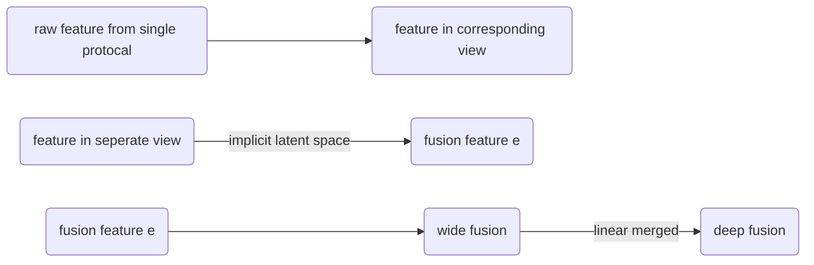

@[TOC](You Are what you boardcast:Identification of Mobile and IoT Devices from public WIFI)

# 1. 摘要/引言

1. 手机设备在接入公共无线网络时，网络没有强制要求手机提交完整的身份信息。因此攻击者可以轻易假冒、篡改自身设备的属性来欺骗网络。
2. 我们通过网络流量的共有特征，为管理者和普通用户提供了一种新颖的设备识别方法。
   - 首先通过被动监听网络的方式，接受网络上的广播和多播包（BC/MC packets）。
   - 使用embedding，把获取的feature model到六个独立的、互补的视图中。
   - 使用多视图+深度学习的方法，提高模型的泛化性能和label-view交互性能。
   - 使用恶意设备检测机制，来针对不同view分类结果不一致时，识别可能的威胁。
3. 目前，移动设备接入网络的主要方式仍然是WIFI和蜂窝网络（cellular），其中WIFI成本低，设备支持性好，容量限制更小。
4. 在网络所有者角度，目前无线网络安全问题主要是起因于：设备多样性、对核心服务和关键服务的获取、缺乏安全管理、缺乏流量审计能力；用户也对接入无线网络时的安全担忧。
5. 对系统管理员，外来设备接入时，获取设备的制造商、类别、型号至关重要。
   - 因为据此可以执行特定的预防措施，例如配置对应防火墙规则、检测这种设备是否有已知的且未修复的安全漏洞、通知入侵检测系统IDS等等。
   - 识别设备类型过后，我们可以节省工作量。因为相似类型/型号的设备会具有共同的访问控制权限，以及防火墙规则，例如咖啡机和茶壶在网络中都只在受限状态下访问网络。
   - 制造商字段还可以帮助我们的设备管理，因为同一制造商的产品在软硬件设计和实现上相似，因此会发布相似的漏洞和对应补丁。
   - 对于用户，在接入WIFI热点时，也需要及时识别网络中的设备，来发现身份伪造的设备，包括偷拍摄像头、虚拟机等等。
6. 主动探测可能会被探测或拒绝，用户可以选择被动侦听广播/多播消息，来识别设备。
7. 目前尚没有标准协议，来主动要求设备表明自己身份，也没有对应的辨别方法。目前的设备识别方法，大多是仅使用网络特征的一小部分（元数据），在控制的实验环境下测试少量数据（包括IoT sentinel）。较小的特征，对应较小的特征空间，在可扩展性上受限，随着新设备加入，准确率也会下降。
8. 本文回答三个问题：
   - 当手机/IoT设备接入无线网络时，哪些协议会广播信息，使得同一个WIFI下的设备都收到这些信息
   - 这些信息是否包含唯一性特征，又如何通过这些特征，获取对用户和管理员有价值的制造商、设备种类、型号信息
   - 如何通过设备识别过程中的信息，来识别恶意设备
9. 本文提出OWL： overhearing on WIFI for device identification。核心想法是利用手机/IoT设备设计过程中，设备网络模块实现的差异性，使得产生的网络数据包具有唯一性特征。OWL寻找这种特征，从多个多播协议中找到对应的数据。OWL同时把相关的协议聚类形成一个view，每个协议产生不同的特征。然后使用多视图学习方法，把所有可用的多播协议特征结合起来，用于设备识别。
10. 此外，恶意设备会尝试伪造身份，以躲避识别和追踪。（例如，一台电脑上的虚拟机谎称是一个开放的WIFI热点，从而欺骗其他设备接入，盗取信息）因为恶意设备安逸伪造整个网络协议占中，所有协议构成的特征集合。因此，对于恶意设备，当有一些协议没有伪造成功时，就会在模型中出现视图不一致情况。（一台电脑上的虚拟机可以在某些视图包含的协议上伪装WIFI接入点，但其他视图上仍然是一台电脑）因此，视图不一致性可以用于分析恶意设备。

# 2. 问题陈述和威胁模型

- 设备识别。设备识别本质是一个分类问题：输入样本和标签，根据二者之间的关系获取特征，然后得出分类结果。在OWL中，device通过一系列BC/MC包所产生的特征表示。OWL通过对未加密流量的被动流量监测来推断设备类型，而不需要任何网络的先验知识。
- 异常设备检测。OWL对BC/MC流量模式偏移已知pattern（训练得出）的设备进行恶意设备检测。对于确认的恶意设备，将恶意流量放到训练网络中进行二次训练，提高未来对这种异常设备检测的准确性。
- 设想和攻击模型。我们假设OWL能够接入到公用的WIFI网络中，假设网络本身一开始是传输正常流量的（即网络中的设备初始都是正常的，都是根据规定的网络协议进行数据包转发和路由），这样才能确保一开始训练的模型能够得出识别正常设备的6个view。


在训练好模型后，再把一个简单的攻击假设来作为威胁模型：攻击者试图把未经授权的设备接入到网络中。这些未授权设备可能是：

- 没有伪造身份的设备（真实身份的设备，可以绕过网站对设备伪造的检测），但是被网络禁止接入的。例如偷拍相机
- 试图伪造自身身份的设备，包括fabricated的和altered设备。这些设备怀有攻击性，例如冒充网络接入点，或者冒充DHCP服务器。
  - Fabricated device（伪造设备）：这指的是一种设备，它被制造出来，以模仿或冒充正常或合法的设备。这种设备通常是为了进行欺诈、恶意活动或非法访问而制造的。例如，攻击者可能制造一个看似合法的银行卡阅读器，以窃取信用卡信息。
  - Altered device（篡改设备）：这指的是一个本来是合法的设备，但经过篡改或修改后，用于进行恶意活动。例如，攻击者可能修改智能手机的操作系统或硬件，以窃取个人信息或进行其他不法行为。
- 假冒产品/盗版产品，例如假的AppleTV来冒充真货，才能与其他Apple产品交互。

> - 对抗样本训练模型的方式通常是在一开始训练时使用标准样本和恶意样本一起训练。这被称为对抗训练（Adversarial Training）。在对抗训练中，模型与对手（通常是生成对抗网络）交互，以生成对抗样本，这些对抗样本是从标准样本中微调而来的，目的是欺骗模型。模型在训练中学习如何鲁棒地处理这些对抗样本，以提高其安全性和鲁棒性。
>
> - 将标准样本和恶意样本分开进行两轮训练的方法被称为"Fine-Tuning"（微调）或"Transfer Learning"（迁移学习）。在这种方法中，模型首先通过标准样本进行初始训练，以学习一般的任务或特征表示。然后，模型通过第二轮训练，使用恶意样本或特定的恶意任务来微调，以适应特定的恶意检测或其他安全任务。
>
>   这种方法的优势在于，它允许使用现有的预训练模型，然后通过微调来适应特定的安全任务，从而在特定任务上取得更好的性能。但需要注意的是，这种方法可能不如对抗训练那样鲁棒，因为在第一轮训练中，模型可能没有暴露于恶意样本或攻击，因此对抗攻击的防御性能可能会较弱。

# 3. 数据收集与特征提取

## 3.1 数据收集和前期分析

在三个实验环境下收集数据：

- 未加密公共网络，包括咖啡店，饭店，零售店等等。不需要任何认证
- 有固定接入点的公共WIFI网络，包括机场，火车站，宾馆等等。在登录页面上不填写任何信息，此时我们可以接入网络，但无法连接网络。这已经足够我们获取BC/MC数据包。
- 安全WIFI网络，包括机构网络和家庭网络。本实验只接入知道密码的网络，然后通过一台PC的Wireshark来获取所有BC/MC数据包。这些数据包都是明文的，且对任何用户都是可见的。

收集结果如下

1. 共有275个不同的协议种类（把不同端口的UDP数据包视作不同的协议），分布如下

   

2. 超过一半的设备通过至少两种协议来发送BC/MC数据包，不到一般的设备通过至少三种协议发送。

3. 约一半的设备发送mDNS数据包，导致设备泄露半-可辨识的属性，其他应用层协议，例如DHCP，SSDP，LLMNR也广泛使用。

4. 协议使用的分布在国家之间是相似的，除了部分协议（使用这些协议的app被中国ban了）

5. 有的协议只被一种设备使用，例如KINK协议只在三星电视上出现。

   - 这些协议可以帮助我们轻松识别所对应的设备
   - 当这个专用协议出现在其他第三方设备上（检测出流量属于其他设备，但某些视图不一致，不一致性出现在这种协议上），这种设备很可能是恶意设备

6. 早期分析中，我们使用Apriori来统计性分析BC/MC协议的特征pattern，使用协议按照频率高低排序。结果如下

   

   可见一个产品系列/家族的产品具有独立的协议使用频率，因产生不同的协议特征。

   而同一厂商的不同产品有着相似的协议使用频率。例如DLink系列有着完全相同的协议模式。因为这些设备的WIFI组件在设计时具有相同的软件和硬件设计。

7. 早期分析表明，使用BC/MC数据包来提取特征，获取设备的厂商、类型、型号信息是可行的。复杂的特征模式也证明了攻击者几乎不可能完美仿造虚假身份设备的所有协议特征，因此是可能检测出攻击行为的。

## 3.2 道德考虑

主要体现在，数据获取是完全被动的，因为需要在真实环境下测试，wireshark没有开启混杂模式（promiscuous）。

而且根据多播和广播协议，我们是这些网络数据包的合法接受者，不存在截取或捕获行为或额外请求行为，否则和攻击者本身是一样的。

因此数据收集没有违反网络协议，也没有添加额外的网络负载。（像SCALENE就测试了添加之后的开销，这个就不需要）

对于敏感数据的处理

- MAC地址，设备的唯一性标识。我们仅收集了MAC地址的前六个位，不足以作为设备的唯一性表示。
- 设备名，像ipad的名字，可能包含用户的姓名，我们在数据预处理中删掉了这个字段和相似的字段。

此外，不再包含其他可能泄露用户隐私的数据，模型也不会收集行为信息，传感器信息，地理信息，可选字段等等

## 3.3 设备识别和特征提取

从获取的数据包中提取设备厂商、类型、型号的三种特征

- 唯一性标识，只要包含该字段就一定可以识别设备类型，即使只支持部分协议类型
- 主要、鲁棒性标识，可以通过组合的方式，共同提供足够的信息来识别设备
- 辅助特征，通过主动访问设备，获取设备的唯一性特征，仅用于后续Evaluation的时候，来判断流量究竟属于哪种设备。（这也说明了我们的原始输入是无标签的，否则就不需要这个特征来识别设备）

### 3.3.1 唯一性标识

根据流行性和鲁棒性，对这些可能具有设备识别唯一性的协议/字段进行列举。


- MAC前缀在每个设备上都有，可以用于做初步推断（因为选取的MAC地址不完整，MAC地址本身也不一定准确）。MAC前缀也只能显示部分设备的WIFI模块的制造商，而不是设备本身的
- DHCP的主机名host name，mDNS的response的answer name都可能包含设备名称，上表的其他数据也都有类似的功能。
- 这些标识在大多数设备上不可获取
- 即使正常用户也可能会更改这些字段，例如ipad的名字
- 好用，但不可靠

### 3.3.2 主要标识

#### 3.3.2.1 键值对型特征

唯一性的键和对应的值。以DHCP为例，

```xml
{"DHCP option code"：code value}
{57:1500}就可以表示第五十七个可选字段最大消息长度的值为1500
{55:[啊，吧，c]}就可以表示请求的参数列表内的值为后面的一个list
```

 	像SSDP，LLMNR，BROWSWR,NBND等协议本身就是由键值对组成的，只需要提取即可。

IP地址不能提供设备识别信息，但ipv4/6和端口号可以提供使用的协议信息。

```xml
{"123.22.222.33":1900}->{ipv4:1900}
MAC->{MAC prefix:xxxxxx}
```

#### 3.3.2.2 伪自然语言特征

包括mDNS payload、使用的协议序列（所有使用的协议排起来）、UDP payload（还没有决定使用某一个传输层协议的）。

把mDNS的资源记录resource records（RRs）、授权域名服务器authoritative nameserver、额外记录看做三个单独的伪自然语言特征。以RR为例，把其中的所有字段切分，以便在特征嵌入时视作一个token（较长的字段可能再进行切分为多个token）。对于其中的ip和mac地址处理和前面相同。

#### 3.3.2.3 辅助特征

有的设备会通过广告来宣传自己的服务，方法是通过广播一个SSDP notify消息，其中包含一个URL，指向一个设备描述xml文件，包含设备的可辨别信息，例如：

```xml
<friendlyName>DELL-PC:dell:</friendlyName>
```

本模型不包含主动访问，因此访问URL获取设备身份的辅助信息仅用于模型测试，不用于训练。

# 4.设备指纹生成和分类

## 4.1算法概述

MvWDL/multi-view wide-deep-learning

设备识别属于分类任务，即预测设备的厂商/类型/型号标签。根据模块3.3的分析，从每个网络协议中提取的信息能提供一定程度上的设备区分能力，但随着设备类型增多，没有一个协议能够单独区分整个设备分布区间的所有设备（一方面是协议自身能力限制，另一方面有的设备网络模块是同一家代加工厂生产的，本身就没有太大的区别）。例如magic-cast和Apple tv在mDNS协议上相似，但是在DHCP和SSDP上相差显著。

因此，我们需要结合不同的协议提取出来的特征，以互补的方式提高在大量设备标签中的区分能力。

在此基础上，我们引入六个视图，将不同协议的特点以视图的形式组织起来：

- 多视图学习能保存协议特征之间多样性和关系，在特征空间的某些领域上起到叠加增强，在领一些领域上起到优势互补的作用。
- 最终的视图融合，把六个独立的视图特征空间合并成一个新的隐藏空间，从而进一步提高泛化和分类能力。

多视图学习在训练过程中追求视图一致性：

- 当一个设备出现明显的视图不一致，那么这要么是一个新设备（IOT sentinel的观点），要么是被篡改的设备。
- 当多个视图对于设备的协议冲突性（预测）表现出很高的置信度时，基本可以确定这是一个被篡改设备。

模型如下


- 首先从BC/MC packet中提取特征

- 对特征映射到不同的隐空间，形成六个视图

- 学习多视图嵌入表示的/融合多个视图特征的，设备指纹特征

- 使用wide-and-deep 学习模型，设计一个混合多视图的神经网络，用于把六个独立互补的视图产生的稠密特征映射到两种结构：

  - 深度神经网络deep，用于早期的特征融合，被设计用来最大化模型的泛化能力
  - 广度神经网络wide，用于后期的特征融合，用于提高对label-view相互作用的记忆能力（输入一个label，view会做出什么样的推断/响应，记住这些view的推断/响应方式）

  > "wide and deep" 是一种深度学习模型架构，主要用于处理推荐系统中的问题。这个模型结合了线性模型（wide）和深度神经网络模型（deep），以平衡学习高阶特征和低阶特征，从而提高推荐系统的准确性。
  >
  > 具体而言，"wide" 部分是一个线性模型，主要用于捕捉低阶特征和特定的输入特征组合，这有助于模型学习一些简单但直接的关联关系。"deep" 部分是一个深度神经网络，用于学习更复杂的高阶特征表示。通过这两个部分的结合，模型可以同时学习到广泛的特征和深层的特征表示，从而在推荐任务中表现更好。
  >
  > "hybrid-fusion" 表示该模型采用融合（fusion）的方式来整合宽度（wide）和深度（deep）部分的信息，以更好地综合两者的优势。这种融合可以通过连接层、共享层或其他方式进行，具体取决于模型的设计。
  >
  > 这种模型结构通常用于处理具有丰富特征的大规模数据，例如推荐系统中的用户-物品交互数据。通过结合线性和深度模型的优势，wide and deep 模型在推荐任务中表现出色。

  > "dense embedding" 指的是将离散的、高维度的输入数据（如类别型特征）映射到低维度的稠密向量空间中的过程。这个过程常常涉及到嵌入层（Embedding Layer）。
  >
  > 对于类别型特征，例如一个产品的ID或者一个单词，传统的方法是使用独热编码（One-Hot Encoding），将每个类别映射成一个高维度的向量，其中只有一个元素为1，其他元素都为0。然而，这样的表示方式存在维度灾难（curse of dimensionality）的问题，因为每个类别对应的向量都是高维的，而数据稀疏性可能导致训练和存储成本的增加。
  >
  > 相反，使用嵌入层，可以将每个类别映射成一个低维度的稠密向量，也称为嵌入向量。这个过程通常是通过训练模型时学习的，嵌入层的权重就是学到的嵌入向量。这样，相对于独热编码，嵌入向量在保留关键信息的同时，减少了表示的维度，降低了计算和存储的复杂性。

- 当检测出试图不一直是，启动恶意设备检测：一个“正”损失函数可以提高正常设备的视图一致性，恶意设备被确认和标记后，使用一个“负”损失函数来表示。即负损失函数用于表示恶意设备的视图一致性程度。

## 4.2设备指纹生成

### 4.2.1 键值对型特征

一个设备的所有键值对特征表示为：
$$
KV_{I}={k_{i,1}:v_{i,1},...,k_{i,n}:v_{i,n}}
$$
包含所有设备键的全局键表：
$$
K={k_1,k_2,...,k_N}
$$
根据在全局键表的位置，设备i的值：
$$
\hat{V}_{KV,i}={v_{i,1},...,v_{i,n}}
$$
value就是之前特征嵌入时的tokens。对于每个设备，都有一个全局键表和一个值表，对于本设备不包含的键直接赋值为null，这样所有设备的键值对特征就可以统一表示了。

### 4.2.2 伪自然语言特征

使用两种基于内容的建模算法：word2vec和LDA算法。

> 1. **Word2Vec:**
>    - **目标：** Word2Vec 的主要目标是将单词映射到连续向量空间，使得具有相似语境的单词在该空间中距离较近。
>    - **工作原理：** Word2Vec 使用神经网络模型，通常是CBOW（Continuous Bag of Words）或Skip-Gram，通过学习上下文中单词的分布来为每个单词生成向量表示。
>    - **应用：** Word2Vec 的向量表示可以用于计算词语之间的相似性，进行词汇推荐，文本聚类等任务。
> 2. **Latent Dirichlet Allocation (LDA):**
>    - **目标：** LDA 是一种生成模型，旨在通过识别文档中的主题来描述文档的生成过程。每个文档被认为是由多个主题的混合组成的，而每个主题又由词语的概率分布组成。
>    - **工作原理：** LDA 假设文档是由主题组成的，而每个主题又由一组单词的概率分布组成。模型通过迭代过程，试图找到一组主题和每个文档中各主题的权重，以及每个主题中单词的权重。
>    - **应用：** LDA 主要用于主题建模，可以用于发现文本数据中隐藏的主题结构，帮助理解大量文本数据的内容。
>
> 虽然Word2Vec和LDA都用于处理文本数据，但它们的目标和方法有很大的不同。Word2Vec更侧重于单词之间的语义相似性，而LDA更专注于文档中的主题结构。在实际应用中，这两种技术可以结合使用，以更全面地理解和处理文本数据。

#### 4.2.2.1 Word2vec

word2vec基于分布式假设：拥有相同上下文的单词具有相似的意思。主要目标是通过单词向量化，找到特征空间，使得相同上下文的向量尽可能的接近。常见的上下文选取是采用滑动窗口。但在我们的模型中，每一个token的上下文都有一个固定的范围，例如从mDNS的RR字段提取的token上下文一定在RR中。因此采取如下措施：

- 建立word-id字典，用来把自然语言中的terms转换成token

- 整个伪自然语言主体部分都用于训练网络M_w2v，用来最大化给定上下文前提下，单词出现的条件概率：
  $$
  argmax\_{\theta} \prod_{(\omega,c)\in D}p(\omega |c;\theta)
  $$
  目标函数使用来优化seta的，D是（单词-上下文）集合。滑动窗口大小为5。不超出word所在的句子。

使用网络来得到每个单词对应的向量。整个句子的向量由每个token向量的均值表示。

#### 4.2.2.2 Latent Dirichlet Allocation

基于词袋模型，无监督学习建立文档-主题=单词结构的模型。生成的是人可理解的主题模型。基于不同设备的主题分布不同的假设，使用LDA来统计性的训练模型，得出自然语言的主题分布。

### 4.2.3 multi-view wide-deep learning

上一模块生成的features，基于来源protocol不同，划分到不同的视图。

*简单协议例如ARP，会在不同设备上展现相同特征。因此，ARP本身没有区分能力，只有在是否使用ARP上能提供信息。*

protocol分类如下：


我们对每个视图生成一个LDA topic空间，以及一个全局word embedding 空间。

现在，每个视图的嵌入表示如下：
$$
views/F=\{v1,v2,v3,v4,v5,v6\}\\
e_i=f^i(v_i;w_i)\\
w_i是视图对应的v_i中的某一列，\\f^i是一系列针对不同列的嵌入操作\\（每一列上使用哪种嵌入操作，id \quad embedding，Word2vec，还是LDA），\\最后对每一列的结果做一个concat，产生视图v_i的最终密集型嵌入向量e_i
$$

#### 4.2.3.1 deep fusion

多模块学习的早期融合部分，早期是因为它发生在网络的较早阶段，即在深层神经网络的输入层或者较浅的隐藏层。

- 我们把稠密的嵌入表示e=[e1,e2,...,e6]拼接成一个向量e，作为fusion network的输入。因为把六个视图的特征向量映射到同一个隐藏空间，所以会是稠密的特征。
- 根据先验知识，选择仿射变换（affine Transformation，线性变换+平移操作）作为注意力操作函数，而不是常用的sum fusion，max fusion，concatenation fusion

$$
g^{att}(\hat{e};W_a,b_a)=softmax(tanh(W^T_a\hat{e}+b_a))\\
e=g^{att}(e_1,e_2,...,e_6)\\
W_a,b_a是仿射变换参数
$$

- 然后把上面注意力机制生成的fusion vector e丢入神经网络f_deep。f_deep主要由一系列标准的多层感知机组成（MLP）。MLP第k层感知机输出为

$$
l^{k+1}=\zeta(W^{(k)}l^{k}+b^{k})\\
\zeta是ReLU激活函数，W^{(k)}，b^{k}是这一层感知机的权重和偏差
$$
- f_deep的目标损失函数为：给定输入的前提下，优化参数，获得最大化条件概率P。训练集C，c和t_c是一组输入样本和标签，seta是参数集合。
  $$
  II(y=t_c):indicater \quad function,取值范围\in\{0,1\}
  $$
  指示函数确保满足条件的因素概率为有意义值，不满足的概率为1，不影响整个训练集的结果。

  深度模型损失如下：

$$
L^{deep} = P(y=t|e;\theta)=\prod_{c=1}^CP(y=t_c|e;\theta)^{II(y=t_c)}
$$
​     优化过程等价于最大化L的对数概率函数，并通过关于seta的随机梯度下降方法来进行优化：
$$
\nabla_\theta  L^{deep} = argmax_{\theta}E_{e\sim \hat{p_{view}}}log(f^{deep}\circ g^{att(e)})\\
E是均值函数，\hat{p_{view}}是输入fusion \quad vector\quad e的分布函数\\
f_deep由一系列标准的多层感知机组成（MLP）
$$
- 作为前馈神经网络，deep fusion network的分类概率f如下

$$
c和t_c是一组输入样本和标签\\
f_{t_c}^{deep}=\frac{exp(L_{t_c}^{(K)})}{\sum_{t_c} exp(L_{t_c}^{(K)})}
$$

1. **Affine Transformation（仿射变换）:**
   - **定义：** 仿射变换是线性变换和平移的组合。在神经网络中，通常表示为权重矩阵的乘法和偏置的加法。
   - **用途：** 仿射变换用于学习数据的线性关系，是神经网络中的基本操作，包括全连接层和卷积层。
2. **Sum Fusion（求和融合）:**
   - **定义：** 求和融合是将多个输入相加的操作。对于两个张量的求和，对应元素相加。
   - **用途：** 通常用于实现残差连接（Residual Connections）等结构，有助于提高网络的训练效果。
3. **Max Fusion（最大值融合）:**
   - **定义：** 最大值融合是将多个输入的相应位置的最大值选取作为输出的操作。对应位置上的元素，选择其中的最大值。
   - **用途：** 常见于一些注意力机制的实现，例如Spatial Attention中的最大池化操作。
4. **Concatenation Fusion（拼接融合）:**
   - **定义：** 拼接融合是将多个输入在某个维度上进行拼接的操作。例如，对于两个矩阵，可以在它们的列维度上进行拼接。
   - **用途：** 常用于多分支网络的设计，将不同分支的特征拼接在一起，提供更丰富的信息。

#### 4.2.3.2 wide fusion

深度融合的目的是提高模型整体的泛化性能，侧重于最后的分类预测。

wide fusion属于late-fusion，是指在网络的较后阶段进行特征融合，即在深层网络的输出层或接近输出层的地方。本文的广度融合用于在网络中记忆特征、视图、标签之间的相互关系。

广度模型的输入和深度融合一样都是fusion feature vector，同样在e的每一个视图分量上使用仿射变换，训练一个线性模型，得出每个视图的独立概率分布
$$
p_i(y=t|e_i)
$$
然后对每一个单独的概率分布优化
$$
\nabla_\theta  L^{wide} = argmax_{\theta} \sum _{e_i \in \hat{e}}E_{e_i\sim \hat{p_{view}}}log(f^{wide}(e_i))\\
f^{wide}(·)是一个单层的，用于分类的网络，输出同样使用softmax进行处理\\
$$
wide fusion的第c个输出就是第c个样本被正确标记的概率，定义为以view划分的独立概率
$$
f_{t_c}^{wide}=\sum_{e_i \in \hat{e}}p_i(y=t_c|e_i)=\sum_{e_i \in \hat{e}}\frac{exp(\omega_i^Te_i+\gamma_i)}{\sum_{t_c} exp(\omega_i^Te_i+\gamma_i)}
$$
wide fusion需要满足：

- 只允许执行现行操作，所以上面式子的omega和gamma都是仿射变换参数。
- **输出经过线性融合后，输入到深度网络deep fusion中**。

> 在宽度模型的输出输入到深度模型的情境中，通常是因为希望综合利用两种模型的优势，这种结合方式被称为**late fusion（后期融合）**。深度模型和宽度模型分别在不同的数据特征或表示层次上表现良好，将它们的输出结合起来可以提高模型的性能。
>
> 下面解释为什么这被称为 "late fusion" 以及与 "early fusion" 的对比：
>
> 1. **Late Fusion (后期融合):**
>    - 在后期融合中，宽度模型和深度模型分别处理输入，产生各自的表示，然后这些表示在模型的后期（通常是在模型的最后一层或之后）合并在一起。这样的结合方式允许模型分别学习数据的不同方面，然后在**后期阶段将这些信息融合**。这种融合方法可以对应到 "late"，因为融合发生在模型的后期。
> 2. **Early Fusion (前期融合):**
>    - 相比之下，前期融合是指**在模型的早期阶段就将不同模态或特征的信息合并在一起**。在深度学习中，这可能涉及将多个输入通道合并在一个深度神经网络的输入层中。这样的结合方式允许模型在训练期间共同学习多个模态的表示。这种融合方法可以对应到 "early"，因为融合发生在模型的早期。
>
> 选择使用 "late fusion" 的原因可能是因为宽度模型和深度模型之间的表示有不同的特性，而在后期融合中，模型能够更灵活地学习如何组合这些表示以达到最佳性能。这也使得模型更容易泛化到新的数据。



最终的分类输出的条件概率为
$$
f_{t_c}^{final}=f_{t_c}^{wide}+f_{t_c}^{deep}
$$

#### 4.3.3 视图一致性和恶意设备检测

论文的第二个任务：恶意设备识别。

通过提高正常设备的视图一致性来提高分类识别准确率，通过提高恶意设备的视图不一致性来提高恶意设备的识别准确率。

假设

- 正常设备的测试用例应当具有尽可能高的视图一致性，也就是wide fusion的不同视图生成的pi应当尽可能相同。数学的一致性原则。
- 一致性原则可以通过co-training或共享隐含子空间来实现。
- 出现不一致性，可能是新设备或恶意设备。领域相关的不一致性假设。

在wide-and-deep模块中，视图在deep模块中对多个视图的预测执行过统一的优化，因此在deep模块的损失函数中已经隐含了视图一致性的优化。

这个模块在进行一次优化，通过基于相关性的损失函数，来显式的最大化训练过程中的视图一致性
$$
corr(p_u,p_v)=||p_u-p_v||_2^2\\
p_u,p_v是在wide模块中，同一个输入样本在两个视图上的输出向量
$$
**基于假设一，把所有样本的损失结合起来，得到增强相关性的损失函数L+**
$$
L^+=\sum_{u,v,k}\in D_{pri}log\frac{1}{1+e^{-corr(p_u^k,p_v^k)}}\\
D_{pri}表示包含所有良性样本的先验数据集（有样本标签），同时假设良性样本远多于恶意样本
$$
**基于假设二，我们认为恶意样本应当尽可能大的体现出视图不一致性**，因此我们使用下面的公式来量化表示，同时用它来进行恶意设备检测
$$
\sum_{1\leq u,v \leq 6}(\eta corr(p_u^k,p_v^k)+(1-\eta)II(A(p_u^k))\neq A(p_v^k))) > \varepsilon
$$
A表示第k个样本输出函数p中最大可能性的样本类别，eta是平衡因子，用于调节概率不一致性和类别不一致的比重，varepsilon是区分新的良性设备和恶意样本的阈值。

我们根据上述式子得出恶意样本后，进行人工二次鉴定，确定后打上标签，用于训练另一个损失函数L-，用于最大化已知恶意设备的视图不一致性
$$
L^-=\sum_{u,v,k}\in D_{pos}log\frac{1}{1+e^{corr(p_u^k,p_v^k)}}\\
D_{pos}表示包含识别出恶意设备后，标记生成的新数据集，只包含被标记的恶意设备。\\
这些样本要从D_{pri}中移除
$$
最终，把这两个损失和融合学习的损失相加，一起优化所有参数，得到对于带标签输入的最好的分类和识别结果：
$$
\hat{h}=L^{deep}+L^{wide}+L^++L^-
$$

- L_deep表示最大似然估计函数，用于优化在给定输入特征的前提下，得出最好的最终分类结果
- L_wide用于优化每一个视图上的独立分类结果
- L+用于最大化良性样本的视图一致性
- L-用于最大化恶意样本的视图不一致性


# 5. 实现、实验

## 5.1 数据集和样本标签

最细粒度的设备识别任务中，设备预期收到三个label：{manufacture，type，model}

基于标签的可信度，把样本分为四个集合

- with validated labels，ground truth data
- labeled in semi-automatic process
- with auxiliary features
- without labels

- 1. ground truth data

  - 在可控环境中收集的数据，包括实验室和实验搭建的家庭网络。
  - 设备是自己选择的，因此一定是真的，也可以获取所有标签信息。
  - ground truth dataset{sample：“manufacture，type，model”}

- 2. semi-automatic device labeling

  - 不可控环境下收集的数据（主要数据来源）

  - 设计半自动化标签标记

    - 1. 对于无标签设备，人工检测数据包中可解释的文本，对于可能一致和良性的标签，就给设备标记成对应的类别。（标签不一定全）

      

    - 2. 当某一种设备模式被发现，就可以创建标记规则

      ```
      {Condition->label}
      例如{MAC:D-link;HostName:DCS-930LB->(D-link,camera,dlink_camera_dcs_9301b)}表示：
      当给定MAC前缀表明是D-link，DHCP的可选字段-12/HostName包含DCS-930LB时，就可以确定设备的类型。
      ```

    - 3. 用规则去判别所有未标记设备，在此过程中可以对规则进行细化和补充，例如共享部分条件的规则前件可以合并。

    - 4. 一个规则用完后，从下一个未标记样本开始，回到1，继续生成规则用于识别下一种设备。

    - 最终，对于不包含三个完整标签的设备，形成注释数据集（需要依靠SSDP的URL信息中包含的注释，进行标签补充）；对于一个标签都没有的数据集，作为额外的测试集。

    - annotation dataset{sample：“manufacture，type，x”/“manufacture，x，model”，“manufacture，x，x”}

    - extra test dataset{sample："x,x,x",label}

    *因为MAC前缀可能表示的是设备的网络模块的制造商，而不是设备本身的，因此对于只包含MAC前缀的设备，视为未标记设备。*

- 3. 净化数据集（Sanitized），这个数据集的样本适用于测试模型性能的下限的。我们使用了半人工读取数据包内容的方法来给样本标签（上面的数据来源2），也通过数据的自然语言部分提取了额外特征（4.2.2）。因此这里，我们对所有的注释样本进行净化：

  具体方法，移除除标签以外的所有标识符，即移除所有用于规则推理的key（condition->label中condition包含的key字段，包含MAC前缀），从而确保这个数据集的样本无法通过数据集2的标记规则，或者人为注释来进行设备识别，只能通过label。

  - sanitized dataset：{sample："x,x,x",label}

- 4. 包含增强特征和补充信息的数据（仅用于测试集）

  在3.3.2.3中，提到可以通过设备描述中，SSDP的notify数据包的URL来获取额外的xml文件，从而获取设备的增强特征。这些特征可用于

  - 对数据集2中注释数据集中，至少包含两个标签的样本进行验证，检测半自动生成标签方法是否准确
  - 对数据集2中注释数据集中，只包含manufacture的样本，和extra test的样本合并成测试集，并使用现在这些注释来填充空缺字段，提高标签准确性

- 5. 不重要特征/无标签样本

  不同类别设备，在这个协议上提取的特征相同，则认为是一个不重要特征。

  识别方法：

  - Apriori方法来寻找每种设备的特征频率，找出最频繁使用的特征。
  - 如果设备使用特征区分度大的协议（mDNS，SSDP，DHCP等等），则移除该设备
  - 剩余设备中，如果某个特征出现次数大于阈值N，则认为是不重要特征。
  - 只包含不重要特征的设备未无标签设备。

## 5.2 实验结果

1. 与其他方法横向对比
2. 在极端条件下的表现（净化数据集）
3. 设备识别速度

评价设备识别性能的三个矩阵：

- 覆盖率C，表示OWL或对比方法能产生标签的设备占总测试集的比例
- 准确率A，正确标签的比例
- 总正确检测率OIR

$$
C=\frac{|labeled\_devices|}{|all\_devices|}\\
A= \frac{|correctly\_labeled\_devices|}{|labeled\_devices|}\\
OIR= \frac{|correctly\_labeled\_devices|}{|all\_devices|}
$$

与目前方法对比，包括基于指纹的和基于规则的。

- 基于指纹的方法从流量中提取指纹特征，使用监督学习。其中WDMTI在multicast数据包指纹中效果较好。
- 基于规则的方法从非加密数据包payload中提取关键词，创建{keyword->device}的规则，用于推导后续的设备类型。目前最好的是ARE。


- a. ground truth data。在MAC地址可获取的前提下，ARE对于设备厂商的推断准确性最高，但因为设备种类和型号在网络流量中不一定可见，ARE无法识别大多数的设备类型。ARE和WDMTI都只覆盖一小部分，因为只支持有限的协议，OWL是从所有可能的广播/多播协议中获取信息

- b. annotated data。因为原始数据都包含厂商信息，OWL和ARE都可以在{manufacture}类型的识别中实现100%覆盖。因为并不是所有设备都包含能被人理解的，充足的信息来实现设备识别，我们也就无法对这些样本的类别和型号进行标记，因此也就无法给ARE进行训练，但是OWL可以获取无人工干预的特征，因此在更细粒度的识别中（{manufacture，type}等等）覆盖率更广。

  然后，使用annotation数据进行数据补充，annotation覆盖的数据不足50%，因此即使OWL能识别出人无法识别的隐含特征（type，model），我们也无法验证。在已有数据的准确率相似的前提下，OWL的覆盖率更大。

- c. sanitized data。和annotated data相反，我们移除raw data中所有人可理解的内容，来测试模型的下界。

  - 第一个柱子{manufacture}可以用所有样本来测试，因为都有对应的label可以用来检测。
  - 第二个柱子{manufacture，type}只选择有对应label的样本来检测。
  - 第三个柱子{manufacture，type，model}，只选择有对应标签的样本来测。

- 

- d. 和其他分类器对比。在多视图wide-deep learning中，选择某种特定的分类器做输出函数，结合特征融合技术，用神经网络来解决该问题。

  - 有足够的特征和样本来支撑深度学习。
  - 需要一个后特征融合模块，来衡量多个视图的不一致性，来执行异常检测。
  - 需要处理不同协议在不同设备上的可分辨度不同。

  因此，把我们4.2.3的MvWDL和机器学习模型 GBDT，以及fastText方法进行对比。

