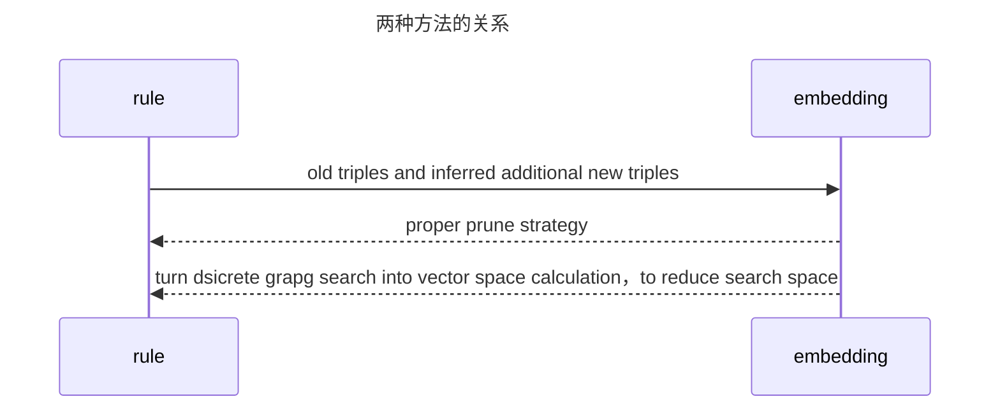
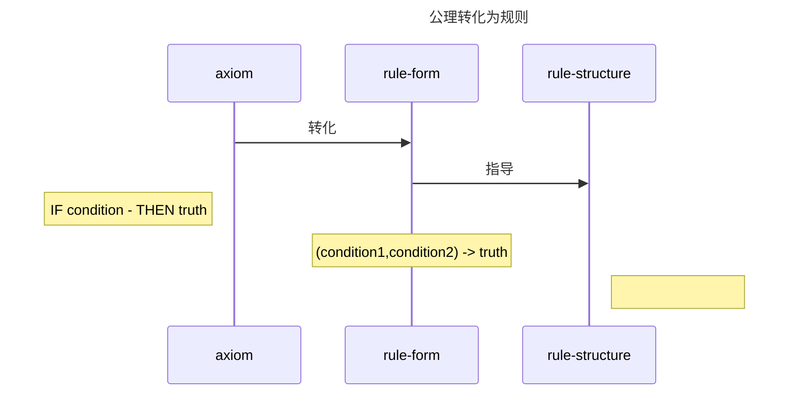
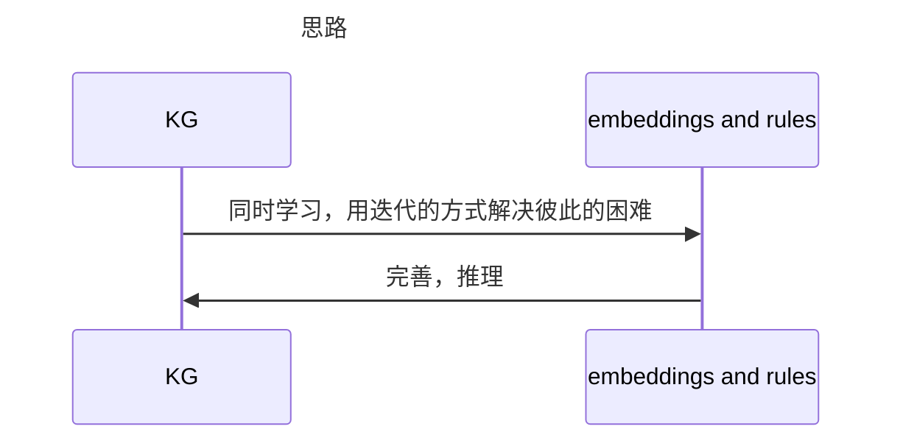
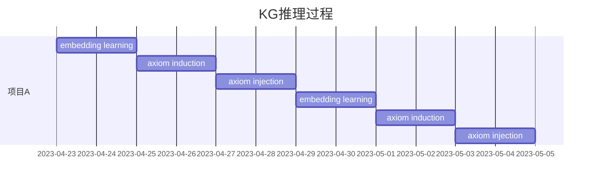

@TOC[Iterative Learning Embedding and Rules for knowledge Graph Reasoning](Iterative Learning Embedding and Rules for knowledge Graph Reasoning)

# Introduction

对于大型图谱，推理是其发展的重要手段。推理的学习方式主要有基于规则的和基于词嵌入两种方式。

- 基于规则的推理准确，可解释性好，但是规则的学习需要在图上进行搜索，会因为搜索空间的增大而存在效率问题。
- 基于词嵌入的方法更加高效，可扩展性强（计算都是在映射的低维向量空间上），但是对于稀疏实体的表示效果不佳（好的映射/词嵌入空间依赖于丰富的数据）。

本文提出全新的IterE模型，结合两种推理方法，迭代学习词嵌入函数（embedding）和推理规则（reasoning）

- 使用合适的剪枝策略，从embedding中学习rule
- 使用rules推理的新triples，解决实体空间稀疏问题

知识图谱的推理可以用于推理新知识（KG completion）和检查知识的一致性（cleaning up KG）。

这二者的推理需要分别计算合适的映射函数和推理规则。

- 基于词嵌入的学习方法包含TransE，HolE，ComplEx，主要通过在连续的向量空间上，学习实体和关系的语法表示，从而保存图谱信息和语义。这种方法的效率依赖于大量的关系和实体。具体关系如下：

  MRR度量“第一个相关的物品在哪里？”，把标准答案在被评价系统给出结果中的**排序取倒数作为它的准确度**，再对所有的问题取平均。

- 基于规则的学习方法准确，可解释，提供给更加细节的推理信息。这种方法会产生效率问题，具体在于决定规则的结构，以及在图中寻找支持三元组。例如，在有10个关系和100个实体的图谱中，一条包含三个关系的规则复杂度是10^3，支持这条规则的三元组数量最大是
  $$
  100^{2*3}*10^3=10^{15}
  $$
  可见复杂度指数上升。

  本文结合了二者，包括多种embedding方法和多种规则。

  - embedding方面，尤其考虑了linear map assumption，因为他天生包含了特殊的，关于规则词嵌入的结论，可以直接用于学习规则。
  - rule方面，使用OWL2标准中的一组预定义规则来进行规则推理。因为网络本体语言对图谱的网络结构完善有指导作用。

  IterE包含三部分：映射学习，公理归纳，公理注入。

  - 映射学习，输入图谱已有三元组和关系推理出的三元组。
  - 公理归纳，根据合适的剪枝规则，产生一个公理池，根据计算在关系嵌入空间上，线性映射假设（linear map assumption）的规则结论。
  - 公理注入，充分利用公理的推理能力，依据公理生成新的三元组，插入图谱，解决数据稀疏问题。

  我们从三个角度衡量系统性能：

  - 公理是否提高了稀疏本体embedding的效率和准确度
  - embedding是否提高了rule学习的效率和质量
  - 迭代学习过程对两个子过程是否都有作用 

# Preliminary

## 2.1 KG embedding

KG triple形如(Tokyo, located_In, Japan)。KG embedding作用是把所有实体和关系映射到一个连续的向量空间，从而转化成向量或矩阵的形式表示（called embedding）。embedding可以用来估计一个三元组真实的概率：
$$
f_{score}:\epsilon \times R \times \epsilon \rightarrow \mathbb{R}
$$
下面介绍两种常见的向量空间映射和对应的得分函数

- Translation-based，把实体和关系映射成向量，同时假设
  $$
  v_s+v_r=v_o
  $$
  对于真实的三元组，等式左右两边应当尽可能相近，从而得到得分函数：
  $$
  \Phi_{translation}=similarity(v_s+v_r,v_o)
  $$
  
- Linear map assumption，把实体映射成向量，把关系映射成矩阵，同时假设subject可以通过relation进行线性变换（拆分为初等矩阵，就可以表示为初等变换），转化成object。
  $$
  v_s * M_r = v_o
  $$
  对于真实的三元组，等式左右两边应当尽可能相近，从而得到得分函数：
  $$
  \Phi_{translation}=similarity(v_s * M_r ， v_o)
  $$

- 从假设检验的角度看，真实三元组的相似度得分必须高；从知识模型的角度看，相似度得分函数就是学习过程中需要优化的目标。学习过程选择最大化目标得分函数或最小化损失函数，因此即使假设的等式在学习到的三元组上可能不成立，我们以可以通过最小化损失函数来选择尽可能可信的新三元组。

## 2.2 Rules Reasoning

$$
X \quad is\quad a\quad set\quad of\quad variables\quad,\\C\quad is\quad a\quad set\quad of\quad constants\\
rule\quad is\quad of\quad the\quad form\quad head\leftarrow body\\
head=R \or X \or C,\\
body=conjection\quad of\quad positive/negative\quad atoms\quad over\quad R \or X \or C\\\\
example:(X,hasFather,Y)\leftarrow(X,hasParent,Y),(Y,gender,male)\\\\
repalce\quad all\quad variables\quad with\quad concrete\quad entities\quad in\quad KG,\\
we\quad get\quad a\quad frouding\quad of\quad rule:\\
(Bob,hasFather,Jack)\leftarrow(Bob,hasParent,Jack),(Jack,gender,male)\\\\
a\quad grouding\quad is\quad a\quad support\quad of\quad the\quad rule
$$

规则学习的过程：
$$
\alpha \quad head \leftarrow body\\
\alpha \in[0,1]表示学习率
$$
把逻辑规则结合到其他学习系统中（例如embedding learning）的方法叫做规则注入。

- 方法1，对实体和关系的表示方法，添加正则化规则或其他限制。通过规则命题化（propositionalization the rules）。在知识推理中，规则通常表示为IF-THEN形式，其中IF部分是先决条件，THEN部分是结论。propositionalization的目标是将规则转化为命题形式，其中每个命题表示一个规则的先决条件和结论之间的关系。
  - (1) 将符号知识表示为谓词逻辑形式；
  - (2) 将谓词逻辑表示转换为命题逻辑形式。
- 方法2，只对部分关系的表示方法添加限制，不直接限制实体。

本文采用法一。

## 2.3 OWL2 Web Ontology Language Axioms（网络本体语言公理）

本文主要学习图谱本体层面的陈述，也就是图谱的主要内容，从而更好地丰富图谱的语义。

> 在OWL2中，axiom可用于表示陈述，用于描述实体之间的关系，例如Class Axiom用于定义类之间的关系，Property Axiom用于定义属性之间的关系，而Individual Axiom用于定义个体之间的关系。
>
> 这些axiom提供了一种形式化的方式来表示实体之间的语义关系，并提供了一种**可计算的方式**来推理这些关系。 OWL2语言中有三种不同的子语言，即OWL Full、OWL DL和OWL Lite，它们在axiom的使用和表达能力上略有不同。
>
> 我们利用一部分陈述，作为构建图谱规则结构的指引。

选择标准：

- 和二元关系相关的陈述，图谱中大多数关系都是二元关系（binary relation）

  *在知识图谱中，binary relation指的是两个实体之间的关系，也称为二元关系。*

- 能够辅助推理的陈述，即这条陈述可能和其他陈述连接成推理链条。

因此，我们选择基于二元表示的，关于对象属性的陈述，其中7种用于推理，另7种用于检验图谱一致性。

对于每条陈述/公理，都是通过自己的成立条件condition来表达自己的语义内容：

同时把condition转化成之前提到的规则支持的形式（head<-body），从而反过来为我们构造规则结构提供参考。

# Method

- embdding learning，讲过好多遍了，用损失函数最小化，去求一个能把entity和relation映射成embedding向量的映射函数。输入格式：
  $$
  ((s,r,o),l_{(s,r,o)})\\
  l_{(s,r,o)}是一个布尔值，表示这个元组是正确的还是错误的
  $$

- axiom induction，公理归纳，根据relation embedding的集合R，对公理集合A进行归纳，每个公理得到一个分数S（axiom）

- axiom injection，对KG中的稀疏实体进行三元组注入，提高对那部分embedding的效率，然后回到embedding learning。 

## 3.1Embedding learning

正例三元组包含图谱原来的部分，加上根据公理推断出来的三元组；负例三元组通过对subject或object或relation进行随机替换得到，从而输入可以如下表示：
$$
I=\{((s,r,o),l_{(s,r,o)})|(s,r,o) \in T \and T_{axiom} \and T_{negative}\}\\
l_{(s,r,o)}=1 \quad if \quad (s,r,o) \in T\\
l_{(s,r,o)}=0 \quad if \quad (s,r,o) \in T_{negative}
$$
对于图谱推理出的三元组，对label分配一个函数：
$$
l_{(s,r,o)}=\pi(s,r,o)\\
\pi(s,r,o)是公理注入时，推理出来的三元组置信标签
$$
从而总损失函数为：
$$
minL_{embedding}=\frac{1}{n}\sum_{((s,r,o),l_{(s,r,o)})\in I}[-l_{sro}log(\phi(s,r,o))-((1-l_{sro})log(1-\phi(s,r,o))]
$$
每个三元组的得分函数为：
$$
\phi(s,r,o)=similarity(\bold v_sM_r,v_o)=\sigma((v_s)^TM_r,v_o)\\
\bold v_s \in \mathbb{R}^{1*d},v_o \in \mathbb{R}^{1*d}\\
\bold M_r \in \mathbb{R}^{d*d}\\
d:embedding\quad dimension
$$
其中关系映射的矩阵限制为块对角线矩阵，每个块是一个实数或[a,-b,b,a]的子矩阵。

该模块输出entity Embedding集合E和relation Embedding集合R

## 3.2 Axiom Induction

使用R集合，推断出候选陈述集合A，对每个陈述进行打分。在进行推理之前，需要对table2种的r1-r3进行实例化。

### 3.2.1 pool generation

生成陈述，选择支持数>1的陈述加入到后续陈述池P中。生成陈述的方法：

- 遍历所有关系r，排列组合去替换陈述中的r1-r3，分别计算各自的support number，时间复杂度O(R3)
- 使用随机游走算法，无法确保对所有公理的覆盖。

本文选择遍历+剪枝+随机游走结合的算法，对于R中每一个关系r：

- 生成一条陈述或陈述的一部分，例如ReflexiveOP（r），SymmetricOP（r），subOP（r'，r），subOP（OPChain（r'，r''），r），其中r'和r''是后续将被其他KG中的r取代的占位符。
- 完善部分陈述，通过随机选择与r相关的k个triple（e'，r，e''），把r'和r''替换成与e‘和e''直接相连的边
- 对生成的备选陈述求支持度，对于支持度大于一的陈述，加入到候选陈述池P中

关键在于k的选择

- 既要避免复杂度太大，又要确保对所有陈述的覆盖程度。

- 高包含率（t），即确保包含绝大部分的，很有可能是正确陈述的备选陈述。（可以用最大似然估计表示）

  > 包含绝大多数正例可以用最大似然估计参数表示，最大似然估计是一种常用的参数估计方法，其基本思想是：在给定观测数据的情况下，估计模型中的未知参数，使得观测数据出现的概率最大。在统计学中，最大似然估计是一种基于观测数据来估计模型参数的方法，它的主要思想是寻找最能解释观测数据的模型参数值。最大似然估计通常用于建立概率模型，然后用观测数据来估计模型参数。在机器学习中，最大似然估计通常用于训练模型中的参数，以便使模型更好地拟合训练数据。

  很有可能的陈述，就是指支持度大于某个阈值的备选陈述，这个阈值叫做最小陈述概率p。

- 满足条件2的，最小的k

对于某个具体的r，替换掉陈述a中头部的r变量的概率：
$$
p(r,a_x)=\frac{n}{N}\\
N:所有三元组数量；n:陈述a_x的支持度（support\quad number）
$$
上述对k的条件2和3可表示为：
$$
min (k) \quad s.t. \quad 1-\frac{C_{(1-p)N}^k}{C_N^k} > t
$$
化简后
$$
k > N-N(1-t)^{\frac{1}{p^N}}
$$
当某条陈述的判断阈值p和对正确陈述的整体包含度t固定，问题转化为求右侧函数的上界。经计算，对于N属于[0,10^15]，该函数复杂度是多项式增长的，有较小的上限。当p0.5,t=0.95是，上界uv=6。

因为输入该模块的是一个固定的图谱K（*虽然模块输入时关系集合R，但是为了补全陈述，引入了实体e，所以这里理解为输入了整个图谱*），所以只需要生成一次pool操作。

### 3.2.2 Axiom predicting

输入：该模块得有关系集合R和陈述池P。

功能：基于table2的rule conclusion字段，对每一个陈述打分。表示为
$$
M_1^a=M_2^a
$$
M1和M2不相等，但是相似，因此，在评估陈述的真实性时，通过矩阵范数，计算等式两边矩阵的相似程度。
$$
s_a(F)=||M_1^a-M_1^a||_F\\
normalize:s_a=\frac{s_{max}(t)-s_a(F)}{s_{max}(t)-s_{min}(t)}\\
t:type \quad of \quad axiom\\
s_{max}(t):P中所有类型t的Frobenius norm分数的最大值\\
s_{min}(t):P中所有类型t的Frobenius norm分数的最小值\\
s_a:最终得分，0-1之间，越高越好
$$

> 正则化：不同陈述因为长度不同，得出的i相似度可能差别很大。
>
> Frobenius norm score：矩阵的Frobenius范数，即矩阵元素绝对值的平方和再开平方

## 3.3 Axiom Injection

最后一个模块了，加油

模块输入：图谱K和候选陈述集合A。

目的：利用陈述的推理功能，为稀疏实体推理新的triples（T_axiom），并给出推理的标记（true/false），为embedding learning模块弥补数据不足。

### 3.3.1 sparce entities

使用如下公式计算实体的稀疏程度：
$$
sparsity(e)=1-\frac{freq(e)-freq{min}}{freq{max}-freq{min}}\\
\theta_{sparsity}=threadhold
$$

>freq(e)表示这个实体出现的三元组数量。
>
>值为1表示是最稀疏的那个，值为0表示是最稠密的那个。
>
>对于数值小于阈值的，认为是稀疏的。

对推理出来的三元组，如果其中涉及稀疏实体e，那么就加入到图谱中：
$$
(s^a,r^a,o^a),s^a \in E_{sparse} \quad or \quad o^a \in E_{sparse} \quad或者两个都是sparse的
$$

### 3.3.2 predicting new triples and their labels

我们使用了grouding来推理新三元组，本文的grouding可以表示为如下形式：
$$
(s^a,r^a,o^a)\leftarrow (s^1,r^1,o^1),(s^2,r^2,o^2),...,(s^n,r^n,o^n)\\
右侧的三元组是从陈述（转换为rule形式的）的，body部分生成的\\
左侧的三元组是图谱不包含的，刚推理出来的三元组
$$
为判断新三元组的label：对n个grouding三元组的label求交集。

> 基于t-范数的模糊逻辑是一种常见的模糊逻辑方法，它使用t-范数（t-norm）来定义逻辑运算。t-范数是一种二元运算，用于计算模糊概率值的交集。在基于t-范数的模糊逻辑中，常用的t-范数包括最小值（min）、乘积（product）、柯西（Cauchy）和哈姆（Hamacher）等。这些t-范数可以用来定义模糊逻辑运算，如模糊与、模糊或、模糊蕴含等。基于t-范数的模糊逻辑方法在模糊控制、模糊决策等领域得到广泛应用。

然后我们对grouding操作使用基于t-范数的模糊匹配：

- 把一个命题逻辑表达式（p∩q等等）的真实值，转化为表达式每个组成部分的值的运算。例如：
  $$
  (s^1,r^1,o^1)=>(s^2,r^2,o^2)可以转化为 \neg {(s^1,r^1,o^1)} \or (s^2,r^2,o^2)
  $$
  就是离散数学的一些公式。

$$
grouding\quad g:(s^1,r^1,o^1)\and(s^2,r^2,o^2)=>(s^a,r^a,o^a)\\
\pi(g)=1-\pi(s^1,r^1,o^1)\pi(s^2,r^2,o^2)+\pi(s^1,r^1,o^1)\pi(s^2,r^2,o^2)\pi(s^a,r^a,o^a)
\\true \quad value\quad of \quad a:\\ \pi(s^a,r^a,o^a)=\frac{\pi(g)-1+\pi(s^1,r^1,o^1)\pi(s^2,r^2,o^2)}{\pi(s^1,r^1,o^1)\pi(s^2,r^2,o^2)}
$$

对于陈述a推理出来的三元组，使用上述步骤生成的grouding的π值作为他的置信得分：
$$
\pi (g_a)=s_a
$$
对于图谱中的三元组，值恒为1

这样就可以对任何陈述推理出来的任何三元组进行标记：
$$
\pi(s^a,r^a,o^a)=s_a
$$
到此，模块执行完毕。我们获得了一个更新过的图谱,其中的新三元组：
$$
T_{axiom}=\{(s^a,r^a,o^a)|s_a \in E_{sparse} \or o_a \in E_{sparse}\}
$$
是由高质量陈述推理得到的，病都有标记
$$
label_{sro}=s_a
$$
从而embedding learning输入更新：
$$
T_{old}=T \and T_{axiom} \and T_{negative}\\
I_{old}=\{((s,r,o),l_{(s,r,o)})|(s,r,o) \in T_{old}\}\\
I=\{((s,r,o),l_{(s,r,o)})|(s,r,o) \in T_{old} \or T_{axiom} \}
$$
进入下一次迭代
