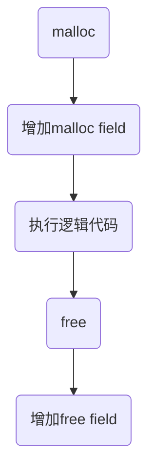

@[TOC](Triangulating Python Performance Issues With Scalene)

# Abstract 

> ​		Scalene Python Profiler是一种用于Python程序性能分析的工具。它可以同时精确地分析CPU、内存和GPU使用情况，并提供低开销的性能分析。Scalene的CPU和内存分析器可以帮助Python程序员区分低效的Python代码和高效的本地执行时间和内存使用情况，从而指导他们的优化工作。Scalene的内存分析器采用一种新颖的采样算法，可以在低开销的同时实现高精度。此外，它还包含一种新颖的算法，可以自动定位Python内存泄漏或跨Python/本地边界的内存泄漏。Scalene跟踪一个称为复制体积的新指标，突出了Python在本地和Python数据表示之间或CPU和GPU之间静默转换时可能发生的昂贵复制操作。

- 同时监控CPU，GPU，内存的使用情况。通过CPU和内存的监控，scalene可以区分低效的python代码和高效的原生代码以及内存使用。
- 在内存监控方面，通过自动向内存泄漏点插入hook-callback代码。
- 引入copy volume，用于计算大对象的，高代价的copy操作。

标准的python语言是基于栈、C实现的、字节码解释器。

- 由于python为对象创建了metadata，占用大量空间。在标准C中，一个整数占4字节，而在python中占28个字节，字符在C占2字节，在python 占50字节。
- python是使用垃圾回收机制的，因此延迟了内存回收，更增加了内存消耗。

目前的解决方案：找到执行效率低、内存消耗大的pure python代码，替换成native library，并添加自己的内存管理逻辑，从而提高代码执行效率。

> **Native Code:**
>
> 1. **性能优势：** 本地代码通常编译为目标平台的机器代码，因此它通常比解释的纯 Python 代码更快。
> 2. **直接访问系统资源：** 本地代码可以直接访问系统资源和库，这使得它适用于系统级编程、图形处理、游戏开发和其他需要高度优化和系统级访问的应用。
> 3. **支持多语言互操作性：** 本地代码可以与其他编程语言互操作，例如通过使用调用C或C++库的接口。
> 4. **底层控制：** 本地代码提供了更多的底层控制，允许开发者更精细地管理内存和其他资源。
>
> **纯 Python:**
>
> 1. **跨平台性：** 纯 Python 代码是跨平台的，因为它运行在 Python 解释器上，而不依赖于底层硬件或操作系统。这使得它适用于开发跨平台应用。
> 2. **开发速度：** 纯 Python 通常编写起来更快，因为不需要编译和链接过程。
> 3. **易于学习：** Python 是一门简单易学的编程语言。
> 4. **高级功能：** Python 提供了丰富的高级功能和库，包括内置数据结构、网络编程、数据库连接等等。
> 5. **自动内存管理：** Python 具有自动内存管理，不需要开发者手动处理内存分配和释放，这降低了错误的风险。

原生代码库：Numpy，SKlearn，TensorFlow等等。通过这些代码代替低效库，可以提高效率和硬件使用率（多核、矢量指令、GPU）。

>
> 矢量指令（Vector Instructions）是一种处理器指令集体系结构，允许单个指令在多个数据元素上执行相同的操作。它们在向量处理器、图形处理单元（GPU）和一些现代中央处理单元（CPU）中广泛使用。矢量指令可以提高硬件效率的原因包括以下几点：
>
> 1. **数据并行性：** 矢量指令使处理器能够同时操作多个数据元素。
> 2. **单指令多数据（SIMD）：** 矢量指令实际上是单指令多数据（SIMD）操作的一种形式。SIMD 操作允许在一个时钟周期内执行多个相同操作，从而提高处理器的吞吐量。
> 3. **内存访问优化：** 矢量指令可以通过一次内存访问来加载多个数据元素，从而减少内存访问的延迟。这有助于降低内存瓶颈对性能的影响。
> 4. **节省指令存储空间：** 使用矢量指令可以减少程序的指令数量，因为一条指令可以涵盖多个数据元素的操作。这减小了指令存储的需求，有助于提高缓存效率。
> 5. **适应多核架构：** 矢量处理对于多核和多线程处理器架构尤为有用。每个核心可以同时处理多个数据元素，从而更好地利用硬件资源。

scalene是一个从底层出发的，专门为python设计的，提供细粒度信息的python执行分析程序。具体而言，scalene利用了CPU工作的时间间隔（idle/apart time），记录内存消耗；并通过矩阵copy volume判别高代价的、在python和native divide（分割）处的，或者CPU和GPU之间的copy操作。

scalene的内存分析器（memory profiler），可以持续记录内存分类情况，检测python和native code中可能泄露的地方。

scalene的GPU分析器判别GPU利用率和内存消耗，判别低效代码出现的位置。

scalene解决了python和之前的解释环境之间的细微区别（JVMs）,包括广泛使用原生库、优化的垃圾回收算法、GPU有限的机器学习应用。

# 2.CPU 分析器/profiling

使用采样的方法，通过利用python传递信号的缺陷，来获得更粗粒度的CPU信息。

具体方法：time-based，每隔一个固定的时间间隔，中断当前执行的程序，检查当前程序计数器的值。当采样数量足够大时，程序计数器的值和程序执行的时间成正比。这种采样可以基于真实时间（CPU执行时间+等待IO事件和中断事件的时间），也可以基于虚拟时间（程序计划执行的时间。只包括CPU执行时间）。

但是，python作为脚本语言（Perl，Ruby等等），Python只会把信号传递给主进程，而且会推迟信号传递，直到python虚拟机重新获得控制权。

> Python等脚本语言(如Perl和Ruby)只会传递信号给主进程，这是因为这些语言在运行原生代码时会推迟（defer）信号的传递，直到虚拟机（即解释器循环）重新控制，并且仅在特定操作码（例如跳转指令）之后检查待处理的信号。 这种设计选择主要是为了避免在运行外部库调用期间产生计时器中断。 结果就是，**在Python执行外部库调用的整个过程中，不会传递计时器信号**。 这样做的效果是，即使实际上执行这些代码所需的时间很长，探查器也会显示没有时间花费在原生代码上。 此外，由于只有主线程会被中断，采样探查器**可能无法计算子线程中花费的时间**。

## 2.1 精准的python-原生代码探查

根据上述分析，可以得出：信号量传递的中断的时间，等于程序执行外部外部库/external code的时间。下图为python执行纯python和调用外部代码的计时采样过程。


采取措施：每当scalene接收到一个CPU计时中断时，记录下当前的虚拟时间virtual time，两个中断之间的时间间隔T，并和python的原子时间间隔q（执行一个python指令的时间）进行对比。

每当scalene接受到一个信号，scalene就遍历python栈，找到触发中断的代码（触发外部库调用的代码），并为这行代码添加python计数器和native-code计数器。每当一行代码触发中断，就对python计数器+q，对native-code计数器+T-q。

## 2.2 精准的python-原生代码探查：线程级别

上述代码执行都是在主进程中，但是没有计算子进程的执行时间，因为子进程是收不到信号的。scalene通过一系列操作来统计子进程的代码执行时间

```shell
monkey patching -> thread enumeration ->stack inspection->bytecode disassembly
```

- monkey patching，指对运行函数进行重定义，有点类似于内存泄漏探测时使用的hook函数，只不过这里用在CPU上。使得程序员能够在不改变源代码的情况下增加、修改或替换函数的行为。

  - 通过对线程阻塞函数进行重写包装，用总是会触发timeout的指令代替thread.join等指令。使得主进程即使被阻塞，也能收到采样信号。
  - 替换这些调用可以强制主线程定期让出执行权并允许信号传递。
  - 此外，对每个thread添加一个状态标志位flag，初值为executing。当scalene见听到一个阻塞调用时，通过python栈找到对应代码，以及系统栈找到对应线程，设置状态为sleeping，执行完之后重新设置为executing。scalene确保只给executing状态的thread分配时间。

- 执行流程：

  ```mermaid
  graph LR
  id1(主线程)--收到信号signal-->id2(scalene)--threading.enumerate-->id3(list of all running threads)
  id2(scalene)--python stack-->id4(python stack frame from each thread)
  id2--walk the stack-->id5(find the corresponding code,attribute execution time)
  id2--bytecode disassembly-->id6(distinguish time spend between py or native-code)
  ```

- 最终通过字节码反汇编/bytecode disassembly，区分python代码和native代码的执行时间。具体而言，查看反汇编之后的字节码是CALL_FUNCTION/CALL_METHOD（native）还是CALL（python3.11）。具体的反汇编映射表事先给定。

- 如果线程执行的是python代码，在执行两个字节码之间几乎没有间隔，而执行的如果是native-code，会在CALL字节码处stuck，直到native execution结束才能执行下一个字节码。这样scalene就能精准分配时间：

  - 如果发现执行CALL代码的stuck行为，把时间分配给native-code counter，否则分配给python counter。

# 3. 内存分析器/Memory and copy volume Profiling

scalene通过行粒度的记录方式，同时追踪Python内外的内存分配。

## 3.1 拦截分配的calls（hook函数）

scalene拦截所有的内存分配调用，包括系统分配函数malloc，free，以及python内部的内存分配调用。然后对所有可能影响内存的操作，使用python内置的memory hook，插入自定义的“shim”allocator。

先对调用进行区分，然后加入hook的操作，就可以分辨是系统分配给library的native memory，还是分配给python编译器的内存。

shim allocator对堆级别的内存分配代码进行扩展和利用。

- 对于Linux系统，注入到的LD_PRELOAD调用之前，实现hook。
- 对于python编译器自己的内存，使用python自定义的内存分配API：PyMem_SetAllocator。

处理calls的方法：通过采样确定，该行代码是否包含在性能统计中，并将这些调用返回值传递给调用的Python或系统分配器。

然而，一个复杂之处在于Python分配器本身可能通过调用系统分配器来处理分配请求。为了避免将Python的分配也计算为系统分配，SCALENE设置了一个标志，存储在特定线程的数据中，表示它处于系统内存分配器中。当带有该标志设置的shim分配器函数被调用时，它会跳过性能分析，直接转发给原始分配器。

这种方法既避免了重复计数，又简化了编写性能分析代码，因为它可以正常分配内存而不会造成无限递归。

## 3.2 基于阈值的采样

- 标准的内存采样方法，包括不包含python的Android、Chrome、Google的tcmalloc，以及JAVA的基于TLAB的采样，使用了基于速率/频率的方法（rate-based），即根据分配/回收字节的大小，决定采样的大小。
  - 每分配或释放一个字节，对应一个具有给定概率p的伯努利试验；例如，如果p = 1/T，则（期望中）每T个字节将进行一次采样。为了效率，这些采样器通常使用从泊松过程或具有相同参数的几何分布中随机选择计数器，进行初始化。然后，每次分配和释放操作都会将该计数器减去分配和释放的字节数，并在计数器降至0以下时触发一次采样。
- 本文采用的基于统计阈值的采样方法，分配器会以字节为单位，记录所有的内存分配和释放的计数。一旦分配和释放之间的绝对差值超过了一个阈值（|A - F| >= T），SCALENE就会触发一次采样：将一个条目追加到采样文件中，并重置计数器。详见图4。当前采样阈值T被设置为略高于10MB的一个质数（SCALENE使用质数来减少不同阈值碰撞，从而减少对采样的干扰风险）
  - 
- 基于速率的采样方法，会对任何分配行为进行采样，产生大量采样文件，而基于阈值方法只会对显著的分配/回收行为进行检测。
- 基于速率的方法采用概率采样，可重复性不够，而基于阈值的采样方法能够确保在有大额内存调度时，能准确记录。
- 基于阈值的采样方法还解决了两个问题：
  1. 避免了基于速率采样中存在的两个偏差来源：
     - 夸大不会显著增加占用空间的分配行为的重要性，因为它不考虑内存回收或占用空间。
     - 使得内存消耗的产生原因出现偏差：把内存消耗归因到运行使用分配器的Python代码行，而不是负责执行空间分配的实际代码。
  2. 基于阈值的采样过滤掉由Python解释器自身创建的大量短时间存在的对象的分配/回收行为，并仅基于改变占用空间的事件触发采样。

## 3.3 收集、处理采样样本

内存采样结束后，scalene会允许tracing对代码进行追踪，直到tracing确认内存修改的那行代码已经执行完毕。这样scalene就可以借助trace来计算每行代码占用的平均内存。

scalene的采样文件：

```html
<allocation or free,fraction of python allocation of total sample,address of the python source code>
```

为了将内存性能的采样样本正确对应到相应的Python源代码段，SCALENE使用C++扩展模块来获取当前线程的调用栈信息，并跳过那些不被跟踪的源代码中执行的帧，直到找到一个调用内存分配的代码地址。

这个归属过程需要在每次采样时进行，所以它被实现为一个C++扩展模块，并且只对Python只读访问。SCALENE在启动时加载这个模块，并使用shim库导出的符号来完成链接，使其能够与shim库正确地进行交互。

此外，SCALENE启动后台线程，从采样文件中读取数据并更新分析统计信息。SCALENE还跟踪当前的内存占用情况，并用于报告最大内存消耗和内存趋势。当越过阈值时（即每次采样时），SCALENE会记录采样时间戳和当前的内存占用情况，用于生成内存趋势的可视化图表（GUI展示部分）。

## 3.4 内存泄漏检测

当一个对象的引用未能安全删除时，垃圾回收控制器就无法回收这块内存，从而内存泄漏。

在python中，正常执行方式是使用tracemalloc，记录没一个分配对象的大小，分配地址，栈帧stack frame（调用的代码位置）。tracemalloc在可能内存泄漏的地方执行快照程序，获取哪那些位置的内存分配情况，最后人工分析快照信息。这种方式费力，而且是事后分析，可能已经在内存中产生不可预知的后果。

scalene的方法：当采样器因内存增长而触发时，算法会检查该增长是否使当前内存状态达到了一个新的最大内存占用（即之前都没现在用的多）。如果是这样的话，算法会记录采样到的分配情况。然后，每次调用free函数时，算法会检查该对象是否被回收。这种检查是廉价的，因为只需要进行一个指针比较，并且几乎总是不成立的（除非一直分配不回收，否则不会频繁达到新的内存分配最大值）。

### Leak score

Leak score：这个得分反映了根据过去的分配行为，他可能泄露内存的可能性

当达到新的最大内存占用时，scalene为当前分配内存的对象更新他的泄露得分。这个得分由scalene

的一系列<object,malloc,free>构成。




- 在开始追踪一行内存分配代码时，增加malloc字段的值
- 在回收对象时，增加free字段的值
- 在对象释放后，对下一个sampled object进行tracking。

当一个网站具有大量的malloc和free操作时，容易发生泄漏；两个字段平衡的网站不会发生泄漏。

使用拉普拉斯递推定理，来计算下一次伯努利实验中失败的概率。
$$
成功回收次数=frees\\
失败次数=(mallocs-frees)\\
根据拉普拉斯定理，内存泄漏概率=\frac{1-(frees+1)}{(mallocs-frees+2)}
$$

### 泄露报告过滤和优化

对report进行过滤和增补（在原始数据上加入统计信息）

- 只选择泄露可能性超过95%的report

- 内存分配/回收比例不平衡 > 总内存1%的report

- 对每种泄露，赋予一个平均泄漏率：
  $$
  平均泄漏率= \frac{某一行代码多次执行的平均内存分配量}{分配内存的时间间隔}
  $$

## 3.5 copy volume matrix

这个矩阵的目的是判别高代价的（往往是错误操作导致的）copy操作，可能发生在python和native-code之间，也可能发生在GPU和CPU之间。

shim library不仅在内存分配上插入，用作hook，也在memcpy上插入，用于监测GPU的数据读写和python与native-code的跨边界数据传输。

- 在内存分配时，如果有超过一定数量的字节被复制，scalene就会在这个采样文件上写入了一个entry。

- 在内存复制上，因为只可能增不可能减，因此基于速率和基于阈值的方法采样效果相似，memcpy采样频率=内存分配频率的n倍。

- ```mermaid
  graph TB
  id1(allocation /thred-based sample)-->id2(memcpy1 / rated-based sample)
  id1(allocation /thred-based sample)-->id3(memcpy2 / rated-based sample)
  id2-->id4(bolck1)
  id2-->id5(bolck2)
  id3-->id6(bolck1)
  id3-->id7(bolck2)
  ```

# 4.GPU profiling

使用行粒度的GPU使用情况和内存分配采样。因为GPU使用矢量运算，一行代码可以放在多个执行单元上执行，所以采用行粒度。

scalene在执行CPU sample的同时执行GPU sample，即每次获取CPUsample的同时，获取当前的GPU运行快照（内存使用比率，与当前执行的代码有关）。

scalene同时对每个进程维护一个accounting，以提升共享GPU环境下的准确性。只有root权限才能设置是否启用GPU上的pid。

> 在共享GPU环境中，为每个进程维护一个独立的accounting（记账）可以提高准确性和公平性:
>
> 1. **资源管理和分配：** 通过为每个进程维护独立的accounting，系统可以更准确地**跟踪每个进程所使用的GPU资源**，包括GPU内存、计算能力等。这使系统能够更精确地分配资源，以确保每个进程都能获得其所需的资源，而不会受到其他进程的干扰。
> 2. **公平性：** 维护独立的accounting可以确保公平性，即每个进程都有平等的机会访问GPU资源。这对于多个用户或任务在共享GPU上运行时尤为重要，以避免某个进程占用了大部分资源，导致其他进程性能下降。
> 3. **限制资源占用：** 独立的accounting允许系统在必要时强制限制每个进程的资源占用。如果一个进程过度使用GPU资源，系统可以采取措施限制其访问，以保护其他进程不受影响。
> 4. **性能监控：** 通过accounting，系统管理员或运维人员可以更容易地监视和诊断每个进程的性能和资源使用情况。这有助于及时发现和解决潜在问题。
> 5. **账单和成本控制：** 在云计算或云GPU环境中，维护accounting可以用于计算每个进程或用户的资源使用成本，从而进行精确的计费和成本控制。
>
> 说白了，就是方便GPU对跑在上面的进程进行查找和管理，也就是在GPU上创建和CPU的pid一样的字段。

# 5.GUI

web网页展示，以及不可交互的--cli（命令行）展示。

使用Ramer-Douglas-Peucker算法，简化曲线上点的数量。该算法通过一个参数：阈值来合并相邻的点。同时，为了提高用户界面的可扩展性，scalene只选择占用1%以上CPU/GPU以及1%memory的代码行。且因为采样的倾斜分布，总的采样数量很小。

> 采样在某些情况下可能会出现偏斜（skewed）的情况，这意味着采样结果不是均匀或随机分布的，而是倾向于某些特定值或区域。这种偏斜可能由以下原因引起：
>
> 1. **不均匀分布的数据：** 当数据本身不是均匀分布的时候，采样可能会反映出这种不均匀性。例如，如果你从一个数据集中进行随机采样，而该数据集中某些值的出现频率远高于其他值，那么采样结果可能会倾向于选择这些高频值。
> 2. **采样方法选择不当：** 采样方法和算法的选择可能会导致偏斜。某些采样方法可能对某些值或区域有更高的概率，而对其他值有较低的概率。如果采样算法不是完全随机的，它可能会引入偏斜。
> 3. **样本大小不足：** 采样的样本大小如果不足够大，可能无法很好地反映整个数据分布。这可能导致偏斜，因为小样本不能很好地代表整个数据集。
> 4. **采样偏向于特定特征或属性：** 在某些情况下，采样可能会被有意或无意地偏向于特定特征或属性，从而导致采样结果的偏斜。

# 6.Evaluation

- scalene的CPU分析准确性为什么高于其他分析器
- scalene的内存分析准确性分析
- scalene的CPU分析开销
- scalene的内存分析开销


## 实验环境